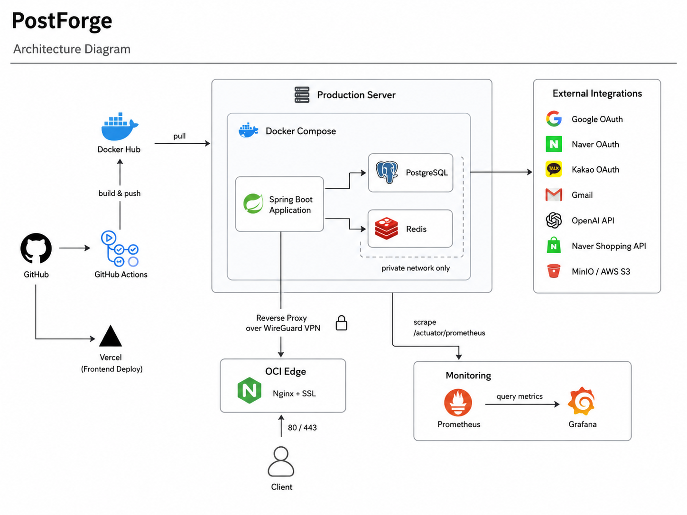
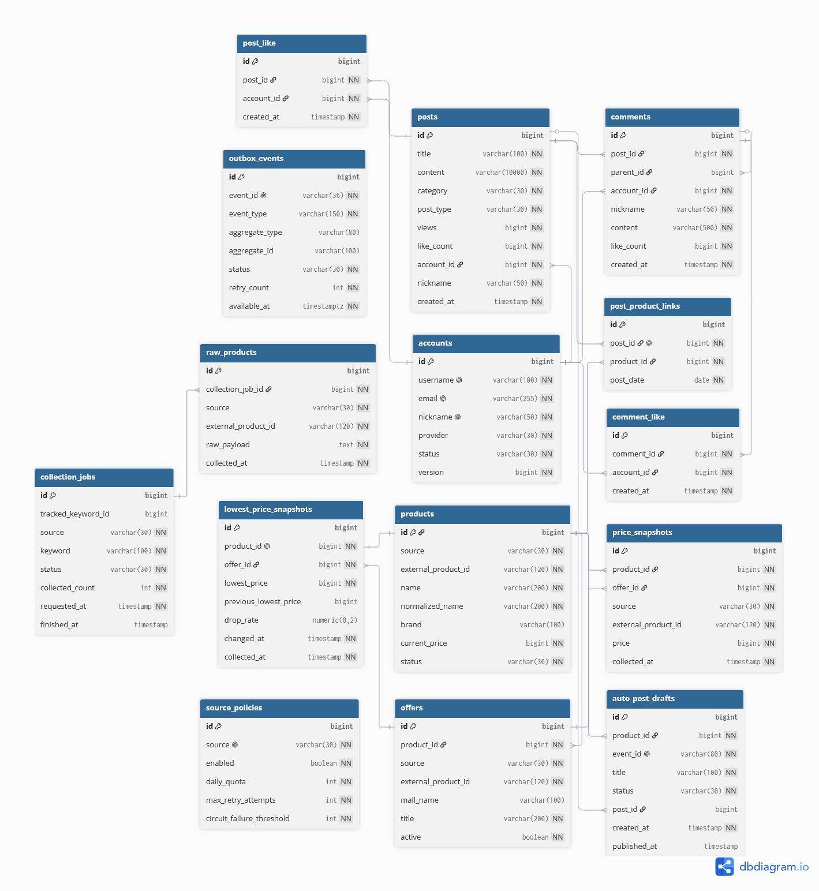

# PostForge

> 외부 쇼핑 API 기반 최저가 추적 커머스 커뮤니티 백엔드

PostForge는 외부 쇼핑 API 데이터를 수집해 정규화 상품과 가격 스냅샷을 저장하고, 최근 수집 기준 최저가와 가격 변동을 제공하는 커머스 커뮤니티 백엔드입니다. 게시글, 댓글, 좋아요, 조회수 같은 커뮤니티 기능 위에 source/ingest/catalog/price 경계, 이벤트 기반 가격 하락 감지, AI 가격 요약 자동 게시 흐름으로 확장하는 것을 목표로 합니다.

현재 구현의 중심은 **운영 가능한 게시판 백엔드 토대**와 **외부 상품 수집 -> catalog 정규화 -> price snapshot/read model** 흐름입니다.

---

## Portfolio Highlights

| Area | What It Shows |
| --- | --- |
| Modular Monolith | DDD-lite style modular monolith. `auth`, `board`, `source`, `ingest`, `catalog`, `price`, `ai`, `messaging`, `core`, `support`, `app` 모듈 분리 |
| Auth / Security | JWT, Redis refresh token, OAuth2, 이메일 인증, 로그인 보호, route policy |
| Board Domain | 게시글, 댓글/대댓글, 좋아요, 조회수, 파일 업로드, 작성자 소유권 검증 |
| Price Tracking Direction | source API 제어, 수집 job/raw product, catalog 정규화, price snapshot/read model 분리 |
| AI / RAG | Spring AI, OpenAI, PgVector, 문서 적재, AI 게시글 생성 foundation |
| Architecture Discipline | module dependency policy, DB ownership, MSA migration concept 문서화 |
| Infra / Deployment | Docker Compose, GitHub Actions, Docker Hub runtime image, layered jar 최적화 |
| Quality Evidence | JUnit, integration tests, Bruno/k6 smoke/load docs, performance reports |

---

## Current Status

| Scope | Status | Notes |
| --- | --- | --- |
| Community Core | Implemented | posts, comments, likes, files, view count |
| Auth Core | Implemented | JWT, Redis refresh token, OAuth2, email verification |
| Price Tracking Platform | In progress | source API log, tracked keyword, collection job, raw product, catalog product, price snapshot/read model |
| Commerce Ingestion | Implemented MVP | mock 상품 수집, 수집 job/log, 상품 정규화 |
| AI/RAG Foundation | Implemented | Spring AI, OpenAI, PgVector, 문서 검색 foundation |
| Docker Runtime | Implemented | Spring Boot layered jar runtime image |
| Testing Docs | Implemented | JUnit, Bruno, k6, performance analysis docs |
| Product Expansion | Implemented | external shopping API collection, price history, pgvector matching, AI price-drop posts |

---

## Architecture



### Module Layout

```text
app       실행 모듈. feature 모듈 조립, route/security/OpenAPI 정책 조립
auth      계정, 로그인, OAuth2, JWT, 이메일 인증, 로그인 보호
board     게시글, 댓글, 좋아요, 파일, 조회수, 상품-게시글 연결, 자동 가격 하락 게시글 초안
source    외부 상품 API adapter, 호출 실행, request log
ingest    상품 수집 orchestration, tracked keyword, collection job, raw product, 문서 적재와 vector 저장 경계
catalog   정규화 상품, 카테고리, offer, product embedding, 유사 상품 매칭 후보
price     가격 스냅샷, 최신 최저가 read model, 가격 하락 조회
ai        AI 채팅, 문서 검색, product embedding 생성 adapter, 가격 하락 게시글 생성
messaging outbox event 저장/릴레이 foundation, future MQ adapter 경계
core      모듈 간 port/contract, 공통 DTO/error/security metadata
support   Redis, JPA auditing, web exception handler 등 Spring infrastructure
```

### Dependency Direction

```text
app       -> support, auth, board, source, ingest, catalog, price, ai, messaging
auth      -> core
board     -> core
source    -> core
catalog   -> core
price     -> catalog, core
ingest    -> source, catalog, price, core
ai        -> core
messaging -> core
support   -> core
core      -> framework API only
```

Design rules:

- Feature module은 다른 feature module의 구현에 직접 의존하지 않습니다.
- Cross-module write는 `core` port 또는 module API를 통해 처리합니다.
- `app`은 조립 계층이며 도메인 소유권을 갖지 않습니다.
- DB table ownership은 [DB Schema Ownership](./docs/db/schema-ownership.md)에 선언합니다.

DDD-lite notes:

- 현재 구조는 DDD-lite style modular monolith입니다.
- `domain` 패키지의 `Account`, `Post` 등은 JPA Entity와 domain model을 분리하지 않고 함께 사용합니다.
- 이는 포트폴리오 규모에서 복잡도를 줄이기 위한 의도적인 선택입니다.
- 완전한 DDD/Hexagonal 구조처럼 persistence model을 별도로 분리한 것은 아닙니다.
- `board`의 일부 DTO는 `presentation/dto`로 모두 이동하지 않고 `board.post.dto` 같은 feature-level DTO로 유지합니다.
- 이 DTO들은 현재 API response와 application result model로 같이 쓰는 경량 DTO이며, 추후 API request/response와 application result를 분리할 경우 `presentation/dto`로 이동할 수 있습니다.

---

## Tech Stack

| Area | Stack |
| --- | --- |
| Language | Java 21 |
| Framework | Spring Boot 3.5.14, Spring Security, Spring Data JPA |
| AI | Spring AI 1.0.7, OpenAI, PgVector |
| Database / Cache | PostgreSQL + PgVector, Redis |
| Auth | JWT, OAuth2, Gmail SMTP |
| Storage | S3-compatible storage, presigned URL |
| API Docs | SpringDoc OpenAPI 2.8.17 |
| Test | JUnit 5, Spring Boot Test, Bruno, k6 |
| Infra | Docker, Docker Compose, Nginx, Let's Encrypt |
| CI/CD | GitHub Actions, Docker Hub |
| Monitoring | Spring Actuator, Prometheus, Grafana |
| Build | Gradle Wrapper 8.14.3, Gradle multi-module |

---

## Implemented Features

### Auth

- JWT access token 발급과 검증
- Redis refresh token 저장 및 재발급 rotation
- OAuth2 로그인: Google, Naver, Kakao
- 이메일 인증 token/state를 Redis TTL로 관리
- 로그인 실패 보호와 계정 잠금
- role 기반 접근 제어
- Actuator 상세 엔드포인트 Basic 인증

### Board

- 게시글 CRUD와 검색
- 댓글과 1-depth 대댓글
- 게시글/댓글 좋아요 등록/취소
- Redis 기반 조회수 중복 방지와 sync
- S3 presigned URL 기반 파일 업로드/다운로드
- 작성자 snapshot과 소유권 검증

### Price Tracking Direction

- `source` 모듈의 외부 상품 source adapter와 external API request log
- `ingest` 모듈의 tracked keyword, collection job, raw product 저장
- `catalog` 모듈의 Product/ProductCategory 정규화 상품 도메인
- `price` 모듈의 price snapshot, latest lowest price read model, 가격 하락 조회
- Mock source 기반 `source -> ingest -> catalog -> price` 수집 흐름

### AI

- Spring AI + OpenAI 기반 채팅 foundation
- PgVector 기반 문서 검색/RAG
- prompt template loader

### Infra / Docs

- Docker Compose 로컬/운영 구성
- GitHub Actions에서 Gradle bootJar 후 runtime image build
- Spring Boot layered jar 기반 Docker runtime image
- SpringDoc OpenAPI group 문서
- JUnit, Bruno, k6 기반 테스트/스모크/부하 테스트 문서
- Prometheus/Grafana/Actuator 기반 모니터링 문서

---

## Data Model



Current implemented storage:

| Owner | Table / Storage | Purpose |
| --- | --- | --- |
| auth | `accounts`, `account_roles` | 계정, OAuth provider identity, 권한 |
| board | `posts`, `post_tags`, `comments` | 게시글, 태그, 댓글/대댓글 |
| board | `post_like`, `comment_like` | 좋아요 원본 데이터 |
| board | `post_file` | S3 object metadata |
| board | `auto_post_drafts` | AI 가격 하락 게시글 초안과 발행 상태 |
| board | `post_product_links` | 상품 관련 게시글과 상품 연결 |
| source | `source_policies`, `external_api_request_logs` | 외부 API 호출 정책과 호출 로그 |
| ingest | `tracked_keywords`, `collection_jobs`, `raw_products` | 수집 대상, 수집 작업, 외부 응답 원본 |
| catalog | `products`, `product_categories`, `offers` | 상품 정규화와 source/mall 판매 상품 |
| catalog | `product_embeddings`, `product_match_candidates` | pgvector 상품 임베딩과 낮은 확신도 유사 상품 매칭 후보 |
| price | `price_snapshots`, `lowest_price_snapshots` | offer 가격 이력과 최저가 read model |
| ai | `vector_store` | Spring AI PgVector 문서 임베딩 |
| Redis | `refresh_token:*`, `email_verify_token:*`, `post:views:*` | 인증 상태, 이메일 인증, 조회수 cache |

---

## API Overview

Actual request/response schemas are available through OpenAPI when the app is running.

### Public

| Method | Endpoint | Purpose |
| --- | --- | --- |
| `POST` | `/auth/register` | 회원가입 |
| `POST` | `/auth/login` | ID/PW 로그인 |
| `POST` | `/auth/token/reissue` | Access Token 재발급 |
| `POST` | `/auth/oauth2/exchange` | OAuth2 code exchange |
| `POST` | `/auth/email/send` | 인증 메일 발송 |
| `GET` | `/auth/email/verify` | 이메일 인증 |
| `GET` | `/posts` | 게시글 목록/검색 |
| `GET` | `/posts/{postId}` | 게시글 상세 |
| `GET` | `/api/posts` | 게시글 목록 |
| `GET` | `/posts/{postId}/comments` | 댓글 목록 |
| `GET` | `/api/products` | 상품 목록 |
| `GET` | `/api/products/search?query={query}` | 상품 검색 |
| `GET` | `/api/products/{productId}` | 상품 상세 |
| `GET` | `/api/products/{productId}/prices` | 가격 변동 이력 |
| `GET` | `/api/products/price-drops` | 가격 하락 상품 목록 |
| `GET` | `/api/products/{productId}/posts` | 상품 연결 게시글 |
| `GET` | `/swagger-ui.html` | Swagger UI |

### Authenticated

| Method | Endpoint | Purpose |
| --- | --- | --- |
| `GET` | `/user/account` | 내 계정 조회 |
| `PATCH` | `/user/account/nickname` | 닉네임 변경 |
| `PATCH` | `/user/account/password` | 비밀번호 변경 |
| `POST` | `/posts` | 게시글 작성 |
| `PUT` | `/posts/{postId}` | 게시글 수정 |
| `DELETE` | `/posts/{postId}` | 게시글 삭제 |
| `POST` | `/posts/{postId}/like` | 게시글 좋아요 |
| `DELETE` | `/posts/{postId}/like` | 게시글 좋아요 취소 |
| `POST` | `/posts/{postId}/comments` | 댓글 작성 |
| `PUT` | `/posts/{postId}/comments/{commentId}` | 댓글 수정 |
| `DELETE` | `/posts/{postId}/comments/{commentId}` | 댓글 삭제 |
| `GET` | `/files/presigned-url` | 파일 업로드 URL 발급 |
| `GET` | `/files/{fileId}/download-url` | 파일 다운로드 URL 발급 |

### AI / Ingest

| Method | Endpoint | Purpose |
| --- | --- | --- |
| `POST` | `/ai/chat` | AI 채팅 |
| `POST` | `/ingest/documents` | 문서 저장 |

### Admin Product Collection

| Method | Endpoint | Purpose |
| --- | --- | --- |
| `POST` | `/api/admin/products` | 상품 수동 upsert |
| `PATCH` | `/api/admin/products/{productId}/hide` | 상품 숨김 |
| `POST` | `/api/admin/tracked-keywords` | 수집 키워드 등록 |
| `GET` | `/api/admin/tracked-keywords` | 수집 키워드 목록 |
| `PATCH` | `/api/admin/tracked-keywords/{id}/disable` | 수집 키워드 비활성화 |
| `POST` | `/api/admin/collection-jobs/manual` | 수동 상품 수집 실행 |
| `GET` | `/api/admin/collection-jobs` | 상품 수집 job 목록 |
| `GET` | `/api/admin/external-api-logs` | 외부 API 호출 로그 |
| `GET` | `/api/admin/source-policies` | 외부 API source 정책 목록 |
| `PUT` | `/api/admin/source-policies` | 외부 API source 정책 설정 |

---

## Local Run

### Requirements

- Java 21+
- Docker / Docker Compose
- PostgreSQL + Redis, usually through `docker-compose.local.yml`
- Optional credentials: OpenAI, Gmail, OAuth2, AWS S3

### Environment

```bash
cp .env.example .env
```

Important env keys:

```env
APP_CORS_ALLOWED_ORIGINS=http://localhost:5173,http://127.0.0.1:5173
APP_OAUTH2_REDIRECT_URL=http://localhost:5173
APP_EMAIL_VERIFICATION_BASE_URL=http://localhost:5173

POSTGRES_DB=postforge
POSTGRES_USER=postgres
POSTGRES_PASSWORD=postgres

REDIS_HOST=localhost
REDIS_PORT=6379

JWT_SECRET=your-secret-key-at-least-32-characters

OPENAI_API_KEY=
```

### Start Infra

```bash
docker compose -f docker-compose.local.yml up -d
```

### Start App

```bash
set -a
source .env
set +a

./gradlew :app:bootRun
```

Swagger UI:

```text
http://localhost:8080/swagger-ui.html
```

---

## Test

### Gradle

```bash
# 전체 테스트
./gradlew test

# 통합 테스트 제외
./gradlew test -PexcludeTags=integration

# 실행 jar 생성
./gradlew :app:bootJar -PexcludeTags=integration
```

### Smoke / Scenario

```bash
./setup/run.sh generate-tests

BASE_URL=http://127.0.0.1:8080 ./setup/run.sh run-smoke
```

Manual k6 scenarios live under `tests/k6/manual`.

Performance and load-test reports are in [docs/performance](./docs/performance/README.md).

---

## Docker / Deployment

### Runtime Image Flow

```text
GitHub push
-> GitHub Actions
-> ./gradlew :app:bootJar
-> Dockerfile.runtime
-> Docker Hub latest + commit SHA
-> server docker compose pull/up
```

`Dockerfile.runtime` uses Spring Boot layered jar extraction:

```text
dependencies
spring-boot-loader
snapshot-dependencies
application
```

This does not primarily reduce final image size.
It improves registry/layer cache behavior by separating stable dependencies from the smaller application layer.

Related docs:

- [Docker Build](./docs/docker/build.md)
- [Docker Image Tests](./docs/docker/image-tests.md)
- [Docker Cache A/B](./docs/docker/cache-ab.md)
- [Compose](./docs/docker/compose.md)

---

## Product Direction

The current direction is:

```text
Mock/external product data
-> source request control
-> ingest collection job/raw product
-> catalog normalization
-> price snapshot and lowest-price read model
-> price-drop event / AI summary draft
-> community reactions
```

Important boundary:

> Product collection, price snapshot updates, and AI/post generation should run on scheduled/admin/event flows, not on every read request.

See:

- [Refactoring Use Cases](refactoring-usecase.md)
- [Refactoring PRD](refactoring-prd.md)
- [Refactoring Architecture](refactoring-architecture.md)
- [Access Policy](./docs/policy/access-policy.md)

Product collection and price metrics exposed through Micrometer:

- `external_api_requests_total`
- `external_api_failures_total`
- `external_api_response_time_seconds`
- `collection_jobs_success_total`
- `collection_jobs_failed_total`
- `collection_jobs_duration_seconds`
- `raw_products_saved_total`

---

## Documentation

| Document | Description |
| --- | --- |
| [DB Schema Ownership](./docs/db/schema-ownership.md) | DB/PgVector/Redis/S3 ownership and migration convention |
| [Access Policy](./docs/policy/access-policy.md) | public/private/admin access boundary |
| [Module Dependencies](./docs/architecture/module-dependencies.md) | module boundary and dependency policy |
| [Gradle Dependency Rationale](./docs/architecture/gradle-dependency-rationale.md) | module-level Gradle dependency decisions |
| [Docker Docs](./docs/docker/README.md) | Docker build, image, cache, compose docs |
| [Performance Reports](./docs/performance/README.md) | k6, Grafana, capacity and cost notes |
| [Redis Key Design](./docs/redis-key-design.md) | Redis key ownership and TTL policy |

---

## Portfolio Talking Points

- Modular monolith로 시작하되 MSA 전환 비용을 낮추기 위해 module boundary와 DB ownership을 문서화했습니다.
- 인증 상태, 이메일 인증, 조회수, 좋아요 보호처럼 TTL/중복 방지가 필요한 영역은 Redis로 분리했습니다.
- 외부 상품 API 호출을 `source`, 수집 작업을 `ingest`, 정규화 상품을 `catalog`, 가격 이력을 `price`로 나눠 장애/소유권 경계를 분리했습니다.
- Mock source 수집부터 raw product, catalog upsert, price snapshot/read model까지 하나의 batch/admin 흐름으로 연결했습니다.
- 사용자 조회는 저장된 catalog/price 데이터를 기준으로 처리하고, 외부 API는 수집 흐름에서만 호출하도록 경계를 잡았습니다.
- Docker runtime image는 Spring Boot layered jar를 사용해 dependency layer와 application layer의 cache 효율을 개선했습니다.
- k6/Grafana 성능 문서와 Docker image 테스트 문서를 남겨 구현 외 운영 관점까지 설명할 수 있게 했습니다.

---

## License

No license file is currently included. Reuse and distribution are controlled by the repository owner.
