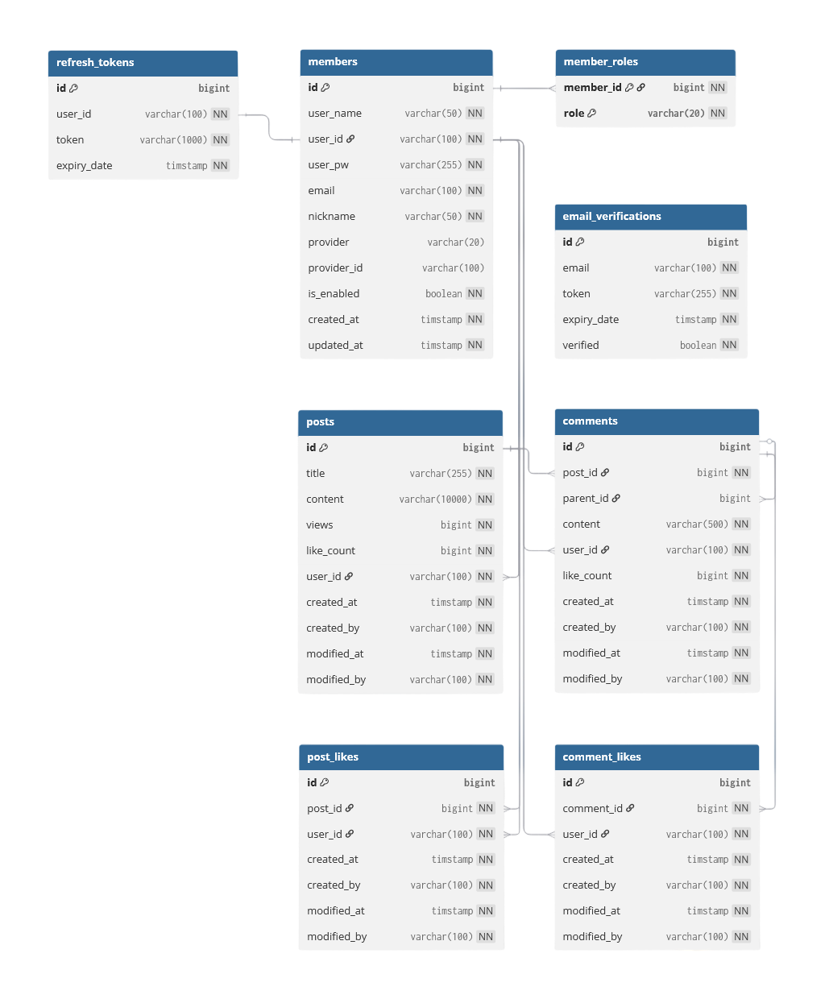

# PostForge

> Spring Boot 기반 멀티 모듈 커뮤니티 백엔드 + 외부 뉴스 수집 + AI/RAG 실험 프로젝트

PostForge는 게시글, 댓글, 좋아요, 파일 업로드 같은 커뮤니티 핵심 기능 위에 JWT/OAuth2 인증, Redis 상태 관리, PostgreSQL/PgVector 기반 RAG, 외부 뉴스 collector, Docker/CI/CD, 성능 테스트 문서화를 함께 구성한 백엔드 포트폴리오입니다.

현재 구현의 중심은 **운영 가능한 게시판 백엔드 토대**입니다.
향후 제품 방향은 수집된 트렌드 데이터를 공개 게시글과 개인 리포트 작성 흐름에 연결하는 것이지만, README에서는 구현된 범위와 검증 근거를 먼저 보여줍니다.

---

## Portfolio Highlights

| Area | What It Shows |
| --- | --- |
| Modular Monolith | DDD-lite style modular monolith. `auth`, `board`, `collector`, `ingest`, `ai`, `messaging`, `core`, `support`, `app` 모듈 분리 |
| Auth / Security | JWT, Redis refresh token, OAuth2, 이메일 인증, 로그인 보호, route policy |
| Board Domain | 게시글, 댓글/대댓글, 좋아요, 조회수, 파일 업로드, 작성자 소유권 검증 |
| External Collection | Naver News collector, 중복 방지, 수집 데이터를 ingest port로 전달 |
| AI / RAG | Spring AI, OpenAI, PgVector, 문서 적재, AI 게시글 생성 foundation |
| Architecture Discipline | module dependency policy, DB ownership, MSA migration concept 문서화 |
| Infra / Deployment | Docker Compose, GitHub Actions, Docker Hub runtime image, layered jar 최적화 |
| Quality Evidence | JUnit, integration tests, Bruno/k6 smoke/load docs, performance reports |

---

## Current Status

| Scope | Status | Notes |
| --- | --- | --- |
| Community Core | Implemented | posts, comments, likes, files, view count |
| Auth Core | Implemented | JWT, Redis refresh token, OAuth2, email verification |
| Collector Foundation | Implemented | Naver News collection, duplicate guard, ingest contract |
| AI/RAG Foundation | Implemented | Spring AI, OpenAI, PgVector, prompt/output guardrail |
| Docker Runtime | Implemented | Spring Boot layered jar runtime image |
| Testing Docs | Implemented | JUnit, Bruno, k6, performance analysis docs |
| Product Expansion | Designed | trend/evidence/private report/cost policy docs |

---

## Architecture


### Module Layout

```text
app       실행 모듈. feature 모듈 조립, route/security/OpenAPI 정책 조립
auth      계정, 로그인, OAuth2, JWT, 이메일 인증, 로그인 보호
board     게시글, 댓글, 좋아요, 파일, 조회수, 게시글 작성 port 구현
collector 외부 뉴스/API 수집, 수집 이력, ingest port 전달
ingest    수집 문서 적재, PgVector 저장, 자동 게시 orchestration
ai        Spring AI, OpenAI, PgVector 설정, AI 게시글 생성, prompt 관리
messaging outbox event 저장/릴레이 foundation, future MQ adapter 경계
core      모듈 간 port/contract, 공통 DTO/error/security metadata
support   Redis, JPA auditing, web exception handler 등 Spring infrastructure
```

### Dependency Direction

```text
app       -> support, auth, board, ai, ingest, collector, messaging
auth      -> core
board     -> core
collector -> core
ingest    -> core
ai        -> core
messaging -> core
support   -> core
core      -> framework API only
```

Design rules:

- Feature module은 다른 feature module의 구현에 직접 의존하지 않습니다.
- Cross-module write는 `core` port 또는 module API를 통해 처리합니다.
- `app`은 조립 계층이며 도메인 소유권을 갖지 않습니다.
- DB table ownership은 [DB Schema Ownership](./docs/db/schema-ownership.md)에 선언합니다.

DDD-lite notes:

- 현재 구조는 DDD-lite style modular monolith입니다.
- `domain` 패키지의 `Account`, `Post` 등은 JPA Entity와 domain model을 분리하지 않고 함께 사용합니다.
- 이는 포트폴리오 규모에서 복잡도를 줄이기 위한 의도적인 선택입니다.
- 완전한 DDD/Hexagonal 구조처럼 persistence model을 별도로 분리한 것은 아닙니다.
- `board`의 일부 DTO는 `presentation/dto`로 모두 이동하지 않고 `board.post.dto` 같은 feature-level DTO로 유지합니다.
- 이 DTO들은 현재 API response와 application result model로 같이 쓰는 경량 DTO이며, 추후 API request/response와 application result를 분리할 경우 `presentation/dto`로 이동할 수 있습니다.

---

## Tech Stack

| Area | Stack |
| --- | --- |
| Language | Java 21 |
| Framework | Spring Boot 3.5.14, Spring Security, Spring Data JPA |
| AI | Spring AI 1.0.7, OpenAI, PgVector |
| Database / Cache | PostgreSQL + PgVector, Redis |
| Auth | JWT, OAuth2, Gmail SMTP |
| Storage | S3-compatible storage, presigned URL |
| API Docs | SpringDoc OpenAPI 2.8.17 |
| Test | JUnit 5, Spring Boot Test, Bruno, k6 |
| Infra | Docker, Docker Compose, Nginx, Let's Encrypt |
| CI/CD | GitHub Actions, Docker Hub |
| Monitoring | Spring Actuator, Prometheus, Grafana |
| Build | Gradle Wrapper 8.14.3, Gradle multi-module |

---

## Implemented Features

### Auth

- JWT access token 발급과 검증
- Redis refresh token 저장 및 재발급 rotation
- OAuth2 로그인: Google, Naver, Kakao
- 이메일 인증 token/state를 Redis TTL로 관리
- 로그인 실패 보호와 계정 잠금
- role 기반 접근 제어
- Actuator 상세 엔드포인트 Basic 인증

### Board

- 게시글 CRUD와 검색
- 댓글과 1-depth 대댓글
- 게시글/댓글 좋아요 등록/취소
- Redis 기반 조회수 중복 방지와 sync
- S3 presigned URL 기반 파일 업로드/다운로드
- 작성자 snapshot과 소유권 검증

### Collector / Ingest

- Naver News API 기반 수집
- original link 기반 중복 방지
- 스케줄러 기반 주기 수집
- 수동 수집 trigger
- `core` ingest port를 통해 ingest 모듈로 수집 문서 전달
- PgVector 저장 후 자동 게시 후보 처리 foundation

### AI

- Spring AI + OpenAI 기반 채팅/생성 foundation
- PgVector 기반 문서 검색/RAG
- 수집 문서 기반 AI 트렌드 분석 게시글 생성 foundation
- prompt template loader
- output guardrail
- `NewsAnalysisPostPublisher` / `PostWriter` port 분리

### Infra / Docs

- Docker Compose 로컬/운영 구성
- GitHub Actions에서 Gradle bootJar 후 runtime image build
- Spring Boot layered jar 기반 Docker runtime image
- SpringDoc OpenAPI group 문서
- JUnit, Bruno, k6 기반 테스트/스모크/부하 테스트 문서
- Prometheus/Grafana/Actuator 기반 모니터링 문서

---

## Data Model



Current implemented storage:

| Owner | Table / Storage | Purpose |
| --- | --- | --- |
| auth | `accounts`, `account_roles` | 계정, OAuth provider identity, 권한 |
| board | `posts`, `post_tags`, `comments` | 게시글, 태그, 댓글/대댓글 |
| board | `post_like`, `comment_like` | 좋아요 원본 데이터 |
| board | `post_file` | S3 object metadata |
| collector | `collected_articles` | 외부 뉴스 수집 이력과 중복 방지 |
| ai | `vector_store` | Spring AI PgVector 문서 임베딩 |
| Redis | `refresh_token:*`, `email_verify_token:*`, `post:views:*` | 인증 상태, 이메일 인증, 조회수 cache |

Target schema and policy drafts are kept under `docs/` instead of expanding this README:

- [ERD Design Draft](./docs/db/postforge-erd-design-draft.md)
- [DBML Draft](./docs/db/postforge-dbdiagram-draft.dbml)
- [Use Case Data Policy](./docs/policy/usecase-data-policy.md)
- [AI Cost Policy](./docs/policy/ai-cost-policy.md)

---

## API Overview

Actual request/response schemas are available through OpenAPI when the app is running.

### Public

| Method | Endpoint | Purpose |
| --- | --- | --- |
| `POST` | `/auth/register` | 회원가입 |
| `POST` | `/auth/login` | ID/PW 로그인 |
| `POST` | `/auth/token/reissue` | Access Token 재발급 |
| `POST` | `/auth/oauth2/exchange` | OAuth2 code exchange |
| `POST` | `/auth/email/send` | 인증 메일 발송 |
| `GET` | `/auth/email/verify` | 이메일 인증 |
| `GET` | `/posts` | 게시글 목록/검색 |
| `GET` | `/posts/{postId}` | 게시글 상세 |
| `GET` | `/posts/{postId}/comments` | 댓글 목록 |
| `GET` | `/swagger-ui.html` | Swagger UI |

### Authenticated

| Method | Endpoint | Purpose |
| --- | --- | --- |
| `GET` | `/user/account` | 내 계정 조회 |
| `PATCH` | `/user/account/nickname` | 닉네임 변경 |
| `PATCH` | `/user/account/password` | 비밀번호 변경 |
| `POST` | `/posts` | 게시글 작성 |
| `PUT` | `/posts/{postId}` | 게시글 수정 |
| `DELETE` | `/posts/{postId}` | 게시글 삭제 |
| `POST` | `/posts/{postId}/like` | 게시글 좋아요 |
| `DELETE` | `/posts/{postId}/like` | 게시글 좋아요 취소 |
| `POST` | `/posts/{postId}/comments` | 댓글 작성 |
| `PUT` | `/posts/{postId}/comments/{commentId}` | 댓글 수정 |
| `DELETE` | `/posts/{postId}/comments/{commentId}` | 댓글 삭제 |
| `GET` | `/files/presigned-url` | 파일 업로드 URL 발급 |
| `GET` | `/files/{fileId}/download-url` | 파일 다운로드 URL 발급 |

### AI / Collector

| Method | Endpoint | Purpose |
| --- | --- | --- |
| `POST` | `/ai/chat` | AI 채팅 |
| `POST` | `/ingest/documents` | 문서 저장 |
| `POST` | `/internal/collector/documents` | collector 문서 적재 + 자동 게시 후보 처리 |
| `POST` | `/collector/naver-news` | Naver News 수동 수집 |

---

## Local Run

### Requirements

- Java 21+
- Docker / Docker Compose
- PostgreSQL + Redis, usually through `docker-compose.local.yml`
- Optional credentials: OpenAI, Gmail, OAuth2, AWS S3, Naver News API

### Environment

```bash
cp .env.example .env
```

Important env keys:

```env
APP_CORS_ALLOWED_ORIGINS=http://localhost:5173,http://127.0.0.1:5173
APP_OAUTH2_REDIRECT_URL=http://localhost:5173
APP_EMAIL_VERIFICATION_BASE_URL=http://localhost:5173

POSTGRES_DB=postforge
POSTGRES_USER=postgres
POSTGRES_PASSWORD=postgres

REDIS_HOST=localhost
REDIS_PORT=6379

JWT_SECRET=your-secret-key-at-least-32-characters

OPENAI_API_KEY=
NAVER_NEWS_CLIENT_ID=
NAVER_NEWS_CLIENT_SECRET=
```

### Start Infra

```bash
docker compose -f docker-compose.local.yml up -d
```

### Start App

```bash
set -a
source .env
set +a

./gradlew :app:bootRun
```

Swagger UI:

```text
http://localhost:8080/swagger-ui.html
```

Collector manual trigger:

```bash
curl -X POST http://localhost:8080/collector/naver-news \
  -H "Authorization: Bearer <admin-access-token>"
```

---

## Test

### Gradle

```bash
# 전체 테스트
./gradlew test

# 통합 테스트 제외
./gradlew test -PexcludeTags=integration

# 실행 jar 생성
./gradlew :app:bootJar -PexcludeTags=integration
```

### Smoke / Scenario

```bash
./setup/run.sh generate-tests

BASE_URL=http://127.0.0.1:8080 ./setup/run.sh run-smoke
```

Manual k6 scenarios live under `tests/k6/manual`.

Performance and load-test reports are in [docs/performance](./docs/performance/README.md).

---

## Docker / Deployment

### Runtime Image Flow

```text
GitHub push
-> GitHub Actions
-> ./gradlew :app:bootJar
-> Dockerfile.runtime
-> Docker Hub latest + commit SHA
-> server docker compose pull/up
```

`Dockerfile.runtime` uses Spring Boot layered jar extraction:

```text
dependencies
spring-boot-loader
snapshot-dependencies
application
```

This does not primarily reduce final image size.
It improves registry/layer cache behavior by separating stable dependencies from the smaller application layer.

Related docs:

- [Docker Build](./docs/docker/build.md)
- [Docker Image Tests](./docs/docker/image-tests.md)
- [Docker Cache A/B](./docs/docker/cache-ab.md)
- [Compose](./docs/docker/compose.md)

---

## Next Product Direction

The current product design work is documented outside the README.
The direction is to connect collected trend data to:

- public posts with evidence links
- private report drafts
- precomputed related trends
- explicit AI usage/cost logging

Important boundary:

> AI should run on explicit write/batch operations, not on every read request.

See:

- [PostForge ERD Design Draft](./docs/db/postforge-erd-design-draft.md)
- [AI Cost Policy](./docs/policy/ai-cost-policy.md)
- [Access Policy](./docs/policy/access-policy.md)
- [Use Case Data Policy](./docs/policy/usecase-data-policy.md)

---

## Documentation

| Document | Description |
| --- | --- |
| [DB Schema Ownership](./docs/db/schema-ownership.md) | DB/PgVector/Redis/S3 ownership and migration convention |
| [ERD Design Draft](./docs/db/postforge-erd-design-draft.md) | target product schema and cost boundaries |
| [DBML Draft](./docs/db/postforge-dbdiagram-draft.dbml) | dbdiagram.io target ERD draft |
| [Access Policy](./docs/policy/access-policy.md) | public/private/admin access boundary |
| [AI Cost Policy](./docs/policy/ai-cost-policy.md) | AI/API cost control rules |
| [Module Dependencies](./docs/architecture/module-dependencies.md) | module boundary and dependency policy |
| [Modular Monolith Rationale](./docs/architecture/modular-monolith-rationale.md) | modular monolith / MSA transition rationale |
| [Gradle Dependency Rationale](./docs/architecture/gradle-dependency-rationale.md) | module-level Gradle dependency decisions |
| [MSA Migration Concepts](./docs/architecture/msa-migration-concepts.md) | DB ownership, outbox, versioning, observability |
| [Docker Docs](./docs/docker/README.md) | Docker build, image, cache, compose docs |
| [Performance Reports](./docs/performance/README.md) | k6, Grafana, capacity and cost notes |
| [Redis Key Design](./docs/redis-key-design.md) | Redis key ownership and TTL policy |

---

## Portfolio Talking Points

- Modular monolith로 시작하되 MSA 전환 비용을 낮추기 위해 module boundary와 DB ownership을 문서화했습니다.
- 인증 상태, 이메일 인증, 조회수, 좋아요 보호처럼 TTL/중복 방지가 필요한 영역은 Redis로 분리했습니다.
- 외부 뉴스 수집은 게시판 도메인에 직접 붙이지 않고 collector -> ingest -> ai/board port 흐름으로 분리했습니다.
- AI/RAG는 기능으로만 붙인 것이 아니라 prompt, output guardrail, PgVector, 자동 게시 orchestration을 분리해 실험했습니다.
- Docker runtime image는 Spring Boot layered jar를 사용해 dependency layer와 application layer의 cache 효율을 개선했습니다.
- k6/Grafana 성능 문서와 Docker image 테스트 문서를 남겨 구현 외 운영 관점까지 설명할 수 있게 했습니다.

---

## License

No license file is currently included. Reuse and distribution are controlled by the repository owner.
