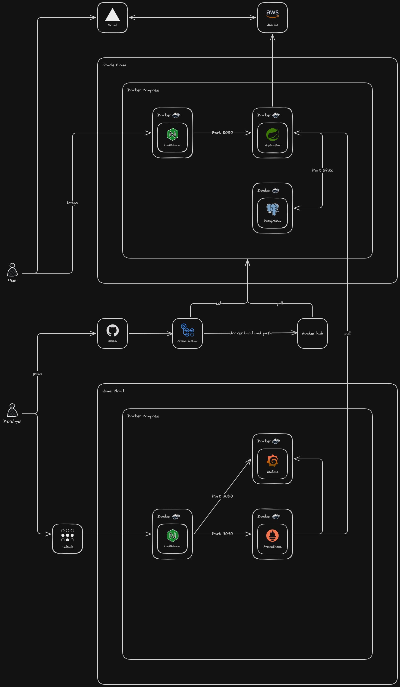

# PostForge

> Spring Boot 기반 멀티 모듈 커뮤니티 게시판 + AI 트렌드 분석 게시글 생성

PostForge는 게시글, 댓글/대댓글, 좋아요 등 커뮤니티 핵심 기능을 제공하는 백엔드 API 서버입니다.
JWT + OAuth2 소셜 로그인, Docker 기반 배포, CI/CD 파이프라인, 모니터링까지 구축했습니다.
또한 네이버 뉴스를 자동 크롤링하고, RAG 기반 AI가 트렌드 분석 게시글을 자동 생성합니다.

---

## 기술 스택

| 분류 | 기술 |
|------|------|
| **Backend** | Java 21, Spring Boot 3.5, Spring Security, Spring Data JPA |
| **AI** | Spring AI 1.0, OpenAI GPT-4o-mini, PgVector (벡터 DB) |
| **Auth** | JWT (Access/Refresh Token), OAuth2 (Google, Naver, Kakao) |
| **Database** | PostgreSQL 18 + PgVector (벡터 검색) |
| **External API** | 네이버 검색 API (뉴스) |
| **File Storage** | S3 호환 스토리지 + Presigned URL 업로드 |
| **Infra** | Docker, Docker Compose, Nginx, Let's Encrypt (SSL) |
| **CI/CD** | GitHub Actions → Docker Hub → Oracle Cloud |
| **Cloud** | Oracle Cloud Infrastructure |
| **Monitoring** | Prometheus + Grafana (Home Cloud) |
| **VPN** | Tailscale |
| **Frontend** | Vercel |
| **Build** | Gradle 8.10 (멀티 모듈) |

---

## 아키텍처



### 요청 흐름

사용자의 HTTPS 요청은 **Nginx** 리버스 프록시를 거쳐 **Spring Boot 애플리케이션**(Port 8080)으로 전달되고, 데이터는 **PostgreSQL**(Port 5432)에 저장됩니다. 두 컨테이너는 **Docker Compose**로 Oracle Cloud 위에서 함께 운영됩니다.

### CI/CD 파이프라인

개발자가 GitHub에 push → **GitHub Actions**가 Docker 이미지 빌드 → **Docker Hub**에 push → 운영 서버에서 최신 이미지 pull 후 배포

### 모니터링

별도 Home Cloud 서버에서 **Prometheus**가 Actuator 메트릭을 수집하고, **Grafana**로 시각화합니다. 모니터링 대시보드는 **Tailscale VPN**을 통해 접근합니다.

---

## ERD


### 테이블 구조

| 테이블 | 설명 |
|--------|------|
| `members` | 회원 정보 (일반 가입 + OAuth2 소셜 로그인, provider/provider_id로 구분) |
| `member_roles` | 회원 권한 (USER, ADMIN, MANAGER) |
| `refresh_tokens` | JWT Refresh Token 저장 및 갱신 관리 |
| `email_verifications` | 이메일 인증 토큰 (30분 유효, 매일 03시 만료 토큰 자동 정리) |
| `posts` | 게시글 (제목, 내용, 조회수, 좋아요 수) |
| `post_file` | 게시글 첨부파일 (원본명, 저장명, 경로, MIME 타입, 고아 파일 자동 정리) |
| `comments` | 댓글 (대댓글 1depth 지원 — `parent_id` 자기참조) |
| `post_likes` | 게시글 좋아요 (user_id + post_id 유니크 제약) |
| `comment_likes` | 댓글 좋아요 (user_id + comment_id 유니크 제약) |

---

## 멀티 모듈 구조

```
PostForge/
├── app/                          # 실행 모듈 (메인 애플리케이션)
│   └── src/main/
│       ├── java/.../app/
│       │   └── ApplicationServer.java
│       └── resources/
│           └── application.yml
│
├── ai/                           # AI 모듈 (RAG 기반 게시글 생성, 채팅)
│   └── src/main/java/.../
│       ├── chat/                 # AI 채팅 (controller, service)
│       ├── document/             # 벡터 DB 문서 저장 (controller, service)
│       └── post/                 # AI 게시글 자동 생성 (controller, service, dto)
│
├── auth/                         # 인증/인가 모듈
│   └── src/main/java/.../
│       ├── email/                # 이메일 인증 (controller, service, entity, scheduler)
│       ├── login/                # 로그인/로그아웃 (CustomUserDetails, LoginService)
│       ├── member/               # 회원 관리 (entity, repository)
│       ├── oauth/                # OAuth2 소셜 로그인 (Google, Naver, Kakao)
│       ├── profile/              # 프로필 조회/수정 (닉네임 변경, 비밀번호 변경)
│       ├── register/             # 회원가입
│       ├── security/             # Security 설정, 인증 예외 처리
│       └── token/                # JWT 관리 (provider, filter, service)
│
├── board/                        # 게시판 모듈
│   └── src/main/java/.../
│       ├── post/                 # 게시글 CRUD, 좋아요, 조회수, BoardPostWriter
│       ├── comment/              # 댓글/대댓글 CRUD, 좋아요
│       ├── common/               # AuditingFields, AuditorAware 설정
│       └── file/                 # 파일 업로드/다운로드, 고아 파일 스케줄러
│
├── core/                         # 공통 모듈
│   └── src/main/java/.../
│       ├── global/exception/     # CustomException, ErrorCode, GlobalExceptionHandler
│       └── post/                 # PostWriter 인터페이스 (모듈 간 디커플링)
│
├── crawl/                        # 크롤링 모듈 (독립 실행)
│   └── src/main/java/.../
│       ├── common/               # AiDocumentSender, DataSourceCrawler
│       ├── config/               # Naver API 설정
│       ├── controller/           # 수동 크롤링 트리거 엔드포인트
│       ├── dto/                  # API 응답 DTO
│       ├── entity/               # CrawledArticle (크롤링 이력)
│       ├── repository/           # CrawledArticleRepository
│       └── service/              # NaverNewsCrawlService
│
├── docs/                         # 문서 및 다이어그램
├── Dockerfile                    # 멀티스테이지 빌드 + BuildKit 캐싱
└── build.gradle                  # 루트 Gradle 설정
```

### 모듈 의존성

```
app → auth, board, ai, core
ai → core     (+ spring-ai, openai, pgvector)
auth → core   (+ spring-security, jwt, mail, oauth2)
board → core  (+ spring-security, aws-s3, tika)
core → spring-data-jpa

crawl (독립 프로젝트, Port 8090) → ai 모듈에 REST 호출
```

---

## 주요 기능

### 인증/인가
- JWT 기반 Stateless 인증 (Access Token 15분 + Refresh Token 7일)
- Token 재발급 (Refresh Token Rotation)
- OAuth2 소셜 로그인 (Google, Naver, Kakao) — 자동 회원 생성
- 이메일 인증 (Gmail SMTP + HTML 템플릿, 30분 유효, 스케줄러로 만료 토큰 자동 정리)
- 역할 기반 접근 제어 (USER, ADMIN, MANAGER)
- 프로필 관리 (닉네임 변경, 비밀번호 변경 — 소셜 로그인 계정 차단)
- Actuator 엔드포인트 별도 HTTP Basic 인증

### 게시판
- 게시글 CRUD + 키워드 검색
- 댓글 및 대댓글 (1depth 제한)
- 게시글/댓글 좋아요 토글 (중복 방지)
- Cookie 기반 조회수 중복 방지 (24시간)
- JPA Auditing (작성자/수정자/작성일/수정일 자동 기록)
- 게시글/댓글 소유자 검증 (`@PreAuthorize` + SpEL)

### 파일 관리
- S3 Presigned URL 기반 클라이언트 직접 업로드
- 허용 확장자 제한 (jpg, jpeg, png, gif, pdf)
- 고아 파일 자동 정리 (매일 03시, 24시간 미연결 파일 삭제)

### AI 트렌드 게시글 자동 생성 (RAG)
- 네이버 뉴스와 유사 문맥을 벡터 DB에 저장 후 유사도 검색
- 뉴스 키워드와 유사 뉴스 문맥을 수집하여 LLM에 전달 (GPT-4o-mini)
- 시스템 프롬프트로 뉴스/이슈 트렌드 분석가 페르소나 적용 (선정적 표현 금지, 출처 인용 필수)
- JSON 형식 응답 파싱 (title, summary, content, tags)
- `PostWriter` 인터페이스를 통한 Board 모듈 연동 (게시글 자동 등록)

### 뉴스 크롤링 (crawl 모듈)
- 네이버 검색 API: 키워드 기반 뉴스 기사 자동 수집
- 중복 방지: 이미 크롤링한 뉴스 기사는 DB 조회로 필터링
- 신규 뉴스는 ingest로 전송된 뒤 AI 트렌드 분석 게시글 자동 생성 대상이 된다
- 스케줄러 기반 주기적 뉴스 크롤링 + 수동 트리거 API 지원

### 예외 처리
- `CustomException` + `ErrorCode` 기반 일관된 에러 응답
- 모듈별 예외 핸들러 분리 (GlobalExceptionHandler, AuthExceptionHandler)
- Validation 에러 필드별 상세 메시지 반환

### 인프라
- Docker 멀티스테이지 빌드 + BuildKit 캐싱 (재빌드 83% 단축)
- Docker Compose 멀티 컨테이너 운영 (App + PostgreSQL)
- Nginx Let's Encrypt SSL 자동 갱신
- GitHub Actions CI/CD 자동화
- Prometheus + Grafana 실시간 모니터링

---

## API 엔드포인트

### 공개 API

| Method | Endpoint                    | 설명 |
|--------|-----------------------------|------|
| `POST` | `/auth/register`            | 회원가입 |
| `POST` | `/auth/login`               | 로그인 |
| `POST` | `/auth/token/reissue`       | 토큰 재발급 |
| `POST` | `/auth/email/send`          | 인증 메일 발송 |
| `GET`  | `/auth/email/verify?token=` | 이메일 인증 |
| `GET`  | `/posts`                    | 게시글 목록 조회 (검색: `?keyword=`) |
| `GET`  | `/posts/{postId}`               | 게시글 상세 조회 |
| `GET`  | `/posts/{postId}/comments`      | 댓글 목록 조회 |

### 인증 필요 API

| Method | Endpoint | 권한 | 설명 |
|--------|----------|------|------|
| `POST` | `/auth/logout` | USER, ADMIN | 로그아웃 |
| `GET` | `/user/profile` | USER, ADMIN | 내 프로필 조회 |
| `PATCH` | `/user/profile/nickname` | USER, ADMIN | 닉네임 변경 |
| `PATCH` | `/user/profile/password` | USER, ADMIN | 비밀번호 변경 |
| `POST` | `/posts` | USER | 게시글 작성 |
| `PUT` | `/posts/{postId}` | 본인/ADMIN | 게시글 수정 |
| `DELETE` | `/posts/{postId}` | 본인/ADMIN | 게시글 삭제 |
| `POST` | `/posts/{postId}/like` | USER | 게시글 좋아요 토글 |
| `POST` | `/posts/{postId}/comments` | USER | 댓글 작성 |
| `PUT` | `/posts/{postId}/comments/{commentId}` | 본인/ADMIN | 댓글 수정 |
| `DELETE` | `/posts/{postId}/comments/{commentId}` | 본인/ADMIN | 댓글 삭제 |
| `POST` | `/posts/{postId}/comments/{commentId}/like` | USER | 댓글 좋아요 토글 |

### AI API

| Method | Endpoint | 설명 |
|--------|----------|------|
| `POST` | `/ai/chat` | AI 채팅 (벡터 DB 기반 RAG) |
| `POST` | `/ai/documents` | 벡터 DB에 문서 저장 |

### 크롤링 API (Port 8090)

| Method | Endpoint | 설명 |
|--------|----------|------|
| `POST` | `/crawl/naver-news` | 네이버 뉴스 수동 크롤링 트리거 |

### 파일 API

| Method | Endpoint | 설명 |
|--------|----------|------|
| `GET` | `/files/s3/presigned-url` | S3 업로드용 Presigned URL 발급 |
| `GET` | `/files/s3/{id}/download-url` | S3 다운로드용 Presigned URL 발급 |

---

## Docker 최적화

멀티스테이지 빌드와 BuildKit 캐싱을 적용하여 빌드 성능을 개선했습니다.

| 버전 | 변경사항 | 재빌드 시간 | 이미지 크기 | 개선율 |
|------|---------|------------|------------|--------|
| v0 | 단일 스테이지 | 1m 32s | 1.77GB | 기준 |
| v1 | 멀티 스테이지 | 1m 29s | 556MB | 이미지 69% 감소 |
| v2 | 의존성 캐싱 | 1m 6s | 556MB | 재빌드 28% 단축 |
| v4 | BuildKit + Alpine | **16s** | 556MB | **재빌드 83% 단축** |

---

## 테스트

테스트는 태그 기반으로 분류하여 관리합니다.

| 태그 | 설명 | 주요 대상 |
|------|------|----------|
| `unit` | 단위 테스트 | Service, Provider, Filter |
| `webmvc` | 컨트롤러 슬라이스 테스트 | Controller (MockMvc) |
| `integration` | 통합 테스트 | 전체 흐름 검증 |

```bash
# 전체 테스트
gradlew test

# 특정 태그 제외
gradlew test -PexcludeTags=integration
```

---

## 실행 방법

### 사전 요구사항
- Java 21+
- Docker & Docker Compose

### 로컬 실행

```bash
# .env 파일 복사하고 실제 값 입력
cp .env.example .env

# DB 실행
docker compose -f docker-compose-local.yml up -d

# Spring Boot 실행
set -a
source .env
set +a
./gradlew bootRun
```

### 환경변수

```env
# Frontend
SPRING_CORS_ALLOWED_ORIGINS=http://localhost:3000

# Database
POSTGRES_DB=postforge
POSTGRES_USER=postgres
POSTGRES_PASSWORD=your_password

# Email (Gmail SMTP)
GMAIL_USERNAME=your_gmail
GMAIL_PASSWORD=your_app_password

# OAuth2 - Google
GOOGLE_CLIENT_ID=
GOOGLE_CLIENT_SECRET=
GOOGLE_REDIRECT_URI=

# OAuth2 - Naver
NAVER_CLIENT_ID=
NAVER_CLIENT_SECRET=
NAVER_REDIRECT_URI=

# OAuth2 - Kakao
KAKAO_CLIENT_ID=
KAKAO_CLIENT_SECRET=
KAKAO_REDIRECT_URI=

# JWT
JWT_SECRET=your_secret_key_at_least_32_characters
JWT_ACCESS_TOKEN_VALIDITY=15
JWT_REFRESH_TOKEN_VALIDITY=7

# AI (OpenAI)
OPENAI_API_KEY=your_openai_api_key

# Crawl 모듈
NAVER_NEWS_CLIENT_ID=your_naver_client_id
NAVER_NEWS_CLIENT_SECRET=your_naver_client_secret
AI_API_BASE_URL=http://localhost:8080
```

---

## 향후 계획

- [x] AI 기반 게시글 자동 생성 (RAG + Spring AI)
- [x] 네이버 뉴스 자동 크롤링
- [x] 성능 측정 및 N+1 쿼리 최적화
- [ ] 검색 기능 고도화 (Elasticsearch)
- [ ] 캐싱 전략 적용 (Redis)
- [ ] API 문서화 (SpringDoc OpenAPI)

---

## 라이선스

이 프로젝트는 MIT 라이선스를 따릅니다.
