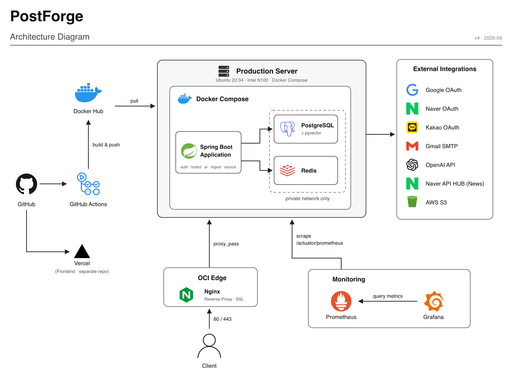

# PostForge

> 뉴스 수집·분류·LLM 초안 작성·스케줄 자동 게시 서비스

PostForge는 외부 뉴스를 수집하고 분야별로 선별한 뒤, LLM으로 본문·요약·태그 초안을 작성해 자동 게시하는 백엔드입니다.
정해진 스케줄에 뉴스 게시글을 발행하고, 매일 **06:00(Asia/Seoul)**에는 전날 게시된 뉴스를 분야별로 종합한 데일리 포스트를 자동 게시합니다.
메일 구독 서비스는 향후 확장 계획입니다.

## 핵심 기능

| 영역 | 현재 구현 |
| --- | --- |
| 뉴스 수집·자동 게시 | Naver API HUB News 수집, 중복·광고·출시 관련성 검사, LLM 초안 생성 후 게시 |
| 분야 분류 | 수집 키워드 또는 수동 요청의 분야를 게시글에 적용하고 분야별로 조회 |
| 데일리 포스트 | 전날 게시된 출시뉴스의 제목·요약을 LLM으로 종합해 분야별 게시글 생성 |
| 인증 | JWT, Redis refresh token rotation, OAuth2, 이메일 인증, 로그인 보호 |
| 게시판 | 게시글, 댓글/대댓글, 좋아요, 조회수, S3 presigned URL, 작성자 소유권 검증 |
| AI / RAG | Spring AI, OpenAI-compatible LLM, PgVector 문서 검색, 수집 자료에 대한 RAG 채팅 |
| 운영 기반 | Flyway baseline, Docker layered jar, 구조화 로그, Prometheus/Grafana |

현재 수집·게시 정책은 신제품 출시뉴스를 대상으로 하며, 뉴스 글은 `PRODUCT_LAUNCH_NEWS`, 데일리 글은 `DAILY_DIGEST`로 저장합니다.
분야는 수집 설정에서 결정하고 LLM은 초안을 작성합니다. 스케줄 실행 안에서 수집부터 게시까지 처리하며, 초안을 별도 예약 대기열에 저장하지는 않습니다.
뉴스 자동 게시는 기본 매시 30분, 데일리는 매일 06:00이고 두 스케줄러는 기본 비활성입니다.
활성화 조건과 환경변수는 [자동 게시 스케줄](./docs/api/README.md#자동-게시-스케줄), 처리 과정은 [뉴스 처리 흐름](./docs/architecture/flows.md#ingest)을 봅니다.

## Architecture



다이어그램 원본은 [PostForge_Architecture_v4.svg](./docs/images/PostForge_Architecture_v4.svg)다.

8개 Gradle 모듈로 구성된 DDD-lite 모듈러 모놀리스입니다.

- `app`: 실행 조립과 route/security/OpenAPI 정책
- `core`: 모듈 간 port, DTO, 오류 및 principal 계약
- `support`: Redis, JPA auditing, 요청 로깅, 공통 MVC 예외 응답
- `auth`, `board`, `source`, `ingest`, `ai`: 기능별 소유권

기능 모듈은 서로의 구현 대신 port 또는 공개 application API를 사용하고, 의존성 방향은
`ModuleBoundaryTest`로 검증합니다.

- [모듈 책임과 의존 방향](./docs/architecture/module-dependencies.md)
- [모듈별 요청 처리 흐름](./docs/architecture/flows.md)
- [모듈러 모놀리스 선택과 MSA 전환 경로](./docs/decisions/adr-003-modular-monolith.md)

## Tech Stack

| 영역 | 기술 |
| --- | --- |
| Runtime | Java 21, Spring Boot 3.5.14, Gradle 8.14.3 |
| Data | PostgreSQL, PgVector, Redis, Spring Data JPA, Flyway |
| Security | Spring Security, JWT, OAuth2, Gmail SMTP |
| AI | Spring AI 1.0.7, OpenAI-compatible API, PgVector |
| Storage | S3-compatible storage |
| API | Spring MVC, SpringDoc OpenAPI |
| Test | JUnit 5, Spring Boot Test, ArchUnit |
| Operations | Docker Compose, GitHub Actions, Prometheus, Grafana, ECS JSON logging |

## Data And API

테이블·Redis key·S3 object 소유권은 [DB Schema Ownership](./docs/database/schema-ownership.md)이 정본입니다.
관계 시각화는 [MVP ERD](./docs/database/postforge-mvp-erd.md)를 봅니다.

신규 DB는 Flyway `V0000__baseline_schema.sql` 이후 증분 migration을 적용합니다.
운영 환경은 `ddl-auto=validate`로 entity와 schema의 일치만 검증합니다.

Endpoint, DTO, status, 인증 조건의 정본은 [API 명세](./docs/api/README.md)입니다.
실행 중에는 [Swagger UI](http://localhost:8080/swagger-ui.html)에서 현재 OpenAPI schema를 확인할 수 있습니다.

## Local Run

필수 도구는 Java 21+와 Docker Compose입니다. credential 없이 바로 부팅되는 로컬 템플릿을 사용합니다.

```bash
cp .env.local.example .env
docker compose -f docker-compose.local.yml up -d
./gradlew :app:bootRun
```

첫 부팅 시 Flyway가 `db/migration`의 baseline(V0000)을 적용해 스키마를 만들고, Hibernate는 `validate`로
엔티티와 스키마가 일치하는지만 검사합니다. 부팅 확인은 `curl localhost:8080/actuator/health`.

[`.env.local.example`](./.env.local.example)은 dummy credential로 부팅까지 보장하는 로컬 템플릿이고,
외부 연동(소셜 로그인, 메일 발송, S3 업로드, 뉴스 수집)을 실제로 쓰려면 해당 키만 진짜 값으로 바꿉니다.
전체 환경변수 목록의 정본은 [`.env.example`](./.env.example)입니다.
실제 secret이 든 `.env`는 커밋하지 않습니다. `bootRun`은 루트 `.env`를 자동으로 읽습니다.

로컬 LLM을 사용할 때 애플리케이션은 OpenAI-compatible gateway를 거쳐 Ollama/Qwen을 호출합니다.
`LLM_CHAT_BASE_URL`에는 Ollama 자체 주소가 아니라 gateway 주소를 설정합니다.

```text
PostForge app
-> OpenAI-compatible LLM gateway
-> Ollama
-> Qwen model
```

## Test

```bash
# 전체 테스트
./gradlew test

# 통합 테스트 제외
./gradlew test -PexcludeTags=integration

# 실행 jar 생성
./gradlew :app:bootJar -PexcludeTags=integration
```

이 저장소에는 현재 전용 부하 테스트 runner가 없습니다. 과거 k6/Bruno/Grafana/API smoke 산출물은
[성능 리포트](./docs/performance/README.md)에 historical evidence로 보관합니다.

## Docker And Deployment

`release/postforge` 브랜치의 CI가 테스트 성공 후 Spring Boot layered jar 기반 runtime image를 만들고,
Docker Hub에 `latest`와 commit SHA tag로 게시합니다. `Dockerfile.runtime`은 non-root 사용자로 실행하며
dependency와 application layer를 분리해 registry cache 효율을 높입니다.

```text
GitHub push
-> ./gradlew check -PexcludeTags=integration
-> ./gradlew :app:bootJar
-> Dockerfile.runtime
-> Docker Hub latest + commit SHA
```

## 문서

| 문서 | 설명 |
| --- | --- |
| [전체 문서 안내](./docs/README.md) | 정본 경계, 읽는 순서, 전체 분류 |
| [API 명세](./docs/api/README.md) | 모듈별 endpoint, DTO, status, 인증 조건 |
| [모듈 의존성](./docs/architecture/module-dependencies.md) | 모듈 책임과 dependency policy |
| [DB Schema Ownership](./docs/database/schema-ownership.md) | DB/PgVector/Redis/S3 소유권과 migration 규칙 |
| [성능 리포트](./docs/performance/README.md) | 현재 검증 표면과 historical evidence 구분 |

## License

No license file is currently included. Reuse and distribution are controlled by the repository owner.
