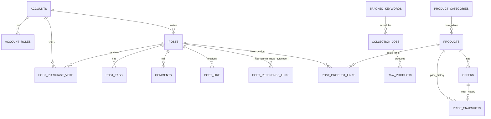

# PostForge

> Spring Boot 기반 멀티 모듈 커뮤니티 백엔드 + 신상품 출시 뉴스 수집/게시 + 가격 판정 커뮤니티

PostForge는 커뮤니티 게시판 위에 **신상품 출시 뉴스 자동 포스팅**, **사용자가 입력한 가격의 네이버 쇼핑 기준 판정**, **출시 뉴스 구매 판단 투표**를 결합한 백엔드입니다. 외부 상품 수집과 가격 스냅샷 이력은 보조 foundation으로 유지하되, 공개 제품 방향은 가격 추적 자체가 아니라 출시 뉴스와 사용자의 구매 판단을 돕는 흐름입니다.

현재 구현의 중심은 **운영 가능한 게시판 백엔드 토대**, **`PRODUCT_LAUNCH_NEWS` 자동 게시**, **response-only price-check**, **구매 판단 투표**입니다.

---

## Highlights

| Area | What It Shows |
| --- | --- |
| Modular Monolith | DDD-lite style modular monolith. `auth`, `board`, `source`, `ingest`, `catalog`, `price`, `ai`, `messaging`, `core`, `support`, `app` 모듈 분리 |
| Auth / Security | JWT, Redis refresh token, OAuth2, 이메일 인증, 로그인 보호, route policy |
| Board Domain | 게시글, 댓글/대댓글, 좋아요, 조회수, 파일 업로드, 작성자 소유권 검증 |
| Price + Launch-News Direction | gated launch-news auto posting, response-only price judgement, source API 제어, price snapshot history 분리 |
| AI / RAG | Spring AI, OpenAI, PgVector, 문서 적재, AI 게시글 초안 생성 foundation |
| Architecture Discipline | module dependency policy, DB ownership, service boundary 근거 |
| Infra / Deployment | Docker Compose, GitHub Actions, Docker Hub runtime image, layered jar 최적화 |
| Quality Evidence | JUnit, integration tests, historical k6/Bruno/API smoke evidence |

---

## Current Status

| Scope | Status | Notes |
| --- | --- | --- |
| Community Core | Implemented | posts, comments, likes, files, view count |
| Auth Core | Implemented | JWT, Redis refresh token, OAuth2, email verification |
| Product/Price Foundation | Implemented MVP | tracked keyword, collection job, raw product, catalog product, price snapshot history. 가격 판정은 response-only로 분리 |
| Product Launch News | Implemented MVP | Naver News 후보를 deterministic gate와 AI draft port 통과 후 `PRODUCT_LAUNCH_NEWS` 게시글로 발행 |
| Price Judgement | Implemented MVP | `POST /api/price-checks`, Naver Shopping 샘플 기준 response-only 판정, 배송비 포함 여부 불확실성 경고 |
| Purchase Vote | Implemented MVP | 자동 게시된 출시 뉴스에 `BUYABLE`/`UNSURE`/`WAIT` 투표 |
| Commerce Ingestion | Implemented MVP | mock/Naver source 계약, 수집 job/log, 상품 정규화 |
| AI/RAG Foundation | Implemented | Spring AI, OpenAI, PgVector, 문서 검색 foundation |
| Docker Runtime | Implemented | Spring Boot layered jar runtime image |
| Testing Docs | Implemented | JUnit, historical k6/Bruno, and HTTP smoke evidence |
| Product Expansion | Implemented | external shopping API collection, price history, pgvector matching. 공개 제품 방향은 launch-news/price-check/vote 중심 |

---

## Product Direction

이번 제품 방향은 세 가지 기능으로 고정합니다.

1. **신상품 출시 뉴스 자동 포스팅**
   - 범용 상품 설명이나 가격 하락 글이 아니라, 새로운 상품 출시/예약판매/공식 발표/공식 가격 공개 같은 뉴스만 `PRODUCT_LAUNCH_NEWS`로 게시합니다.
   - 중복 기사, 광고성 기사, 출처 불명 기사, 필수 키워드 미포함 기사, AI 요약 실패, 같은 상품/키워드 당 일일 한도 초과 후보는 제외합니다.

2. **네이버 쇼핑 기준 가격 판정**
   - 사용자가 상품명/옵션/판매가/쿠폰/카드할인/최종 결제액을 입력하면 `POST /api/price-checks`가 Naver Shopping 샘플과 비교해 response-only 결과를 반환합니다.
   - 판정 결과는 저장하지 않고 게시글도 만들지 않습니다.
   - 비교는 배송비 포함 가격을 우선 사용하되, 배송비 포함 여부가 확인되지 않은 샘플은 `배송비 포함 여부 미확인` 경고와 낮은 confidence를 표시합니다.

3. **출시 뉴스 구매 판단 투표**
   - `PRODUCT_LAUNCH_NEWS` + `SYSTEM_BATCH` 게시글에만 `BUYABLE`, `UNSURE`, `WAIT` 투표를 허용합니다.
   - 투표 집계는 공개 신뢰 신호이며, `myVote`만 인증된 회원 기준으로 계산합니다.

---

## Architecture


### Module Layout

```text
app       실행 모듈. feature 모듈 조립, route/security/OpenAPI 정책 조립
auth      계정, 로그인, OAuth2, JWT, 이메일 인증, 로그인 보호
board     게시글, 댓글, 좋아요, 파일, 조회수, 게시글 작성 port 구현
source    외부 상품/뉴스 API adapter와 호출 실행 계약
ingest    상품/뉴스 수집 orchestration, tracked keyword, collection job, raw product, 문서 적재와 vector 저장 경계
catalog   정규화 상품, 카테고리, offer, product embedding, 유사 상품 매칭 후보
price     가격 스냅샷 이력 저장, 가격 이력 조회, response-only 가격 판정
ai        AI 채팅, 문서 검색, product embedding 생성 adapter, 게시글 초안 생성
messaging outbox event 저장 foundation, relay disabled by default, future MQ adapter 경계
core      모듈 간 port/contract, 공통 DTO/error/security metadata
support   Redis, JPA auditing, web exception handler 등 Spring infrastructure
```

### Dependency Direction

```text
app       -> support, auth, board, source, ingest, catalog, price, ai, messaging
auth      -> core
board     -> core
source    -> no project dependency
catalog   -> core
price     -> source, catalog, core
ingest    -> source, catalog, price, core
ai        -> catalog, core
messaging -> core
support   -> core
core      -> framework API only
```

Design rules:

- Feature module은 다른 feature module의 구현에 직접 의존하지 않습니다.
- Cross-module write는 `core` port 또는 module API를 통해 처리합니다.
- `app`은 조립 계층이며 도메인 소유권을 갖지 않습니다.
- DB table ownership은 [DB Schema Ownership](docs/database/schema-ownership.md)에 선언합니다.

DDD-lite notes:

- 현재 구조는 DDD-lite style modular monolith입니다.
- `domain` 패키지의 `Account`, `Post` 등은 JPA Entity와 domain model을 분리하지 않고 함께 사용합니다.
- 이는 포트폴리오 규모에서 복잡도를 줄이기 위한 의도적인 선택입니다.
- 완전한 DDD/Hexagonal 구조처럼 persistence model을 별도로 분리한 것은 아닙니다.
- `board` API DTO는 현재 `presentation/dto` 아래에 두고, application 내부 result와 구분합니다.

---

## Tech Stack

| Area | Stack |
| --- | --- |
| Language | Java 21 |
| Framework | Spring Boot 3.5.14, Spring Security, Spring Data JPA |
| AI | Spring AI 1.0.7, OpenAI, PgVector |
| Database / Cache | PostgreSQL + PgVector, Redis |
| Auth | JWT, OAuth2, Gmail SMTP |
| Storage | S3-compatible storage, presigned URL |
| API Docs | SpringDoc OpenAPI 2.8.17 |
| Test | JUnit 5, Spring Boot Test, k6 load scenarios |
| Infra | Docker, Docker Compose, Nginx, Let's Encrypt |
| CI/CD | GitHub Actions, Docker Hub |
| Monitoring | Spring Actuator, Prometheus, Grafana |
| Build | Gradle Wrapper 8.14.3, Gradle multi-module |

---

## Implemented Features

### Auth

- JWT access token 발급과 검증
- Redis refresh token 저장 및 재발급 rotation
- OAuth2 로그인: Google, Naver, Kakao
- 이메일 인증 token/state를 Redis TTL로 관리
- 로그인 실패 보호와 계정 잠금
- role 기반 접근 제어
- Actuator 상세 엔드포인트 Basic 인증

### Board

- 게시글 CRUD와 검색
- 댓글과 1-depth 대댓글
- 게시글/댓글 좋아요 등록/취소
- Redis 기반 조회수 중복 방지와 sync
- S3 presigned URL 기반 파일 업로드/다운로드
- 작성자 snapshot과 소유권 검증
- 자동 게시된 `PRODUCT_LAUNCH_NEWS` 게시글의 구매 판단 투표와 출처 evidence 노출

### Launch News / Price Check / Product Collection

- `source` 모듈의 외부 상품 source adapter와 `MOCK`/`NAVER` routing contract
- `source` 모듈의 Naver News source adapter
- `ingest` 모듈의 tracked keyword, collection job, raw product 저장, 뉴스 문서 수집, gated launch-news auto posting
- `ingest.news.launch.scheduler.enabled=true`이면 active tracked keyword를 `SYSTEM_BATCH` origin 출시 뉴스 게시로 실행한다. cron은 `ingest.news.launch.cron`으로 조정한다.
- `catalog` 모듈의 Product/ProductCategory 정규화 상품 도메인
- `price` 모듈의 price snapshot history, 가격 이력 조회, `POST /api/price-checks` response-only 가격 판정
- `source -> ingest -> catalog -> price` 수집 흐름
- 가격 판정은 Naver Shopping 검색 가격을 기준으로 하며 `basePrice`, `shippingFee`, `discountAmount`, `finalPaidPrice` 입력을 반영한다. 배송비 포함 여부를 확인하지 못하면 `배송비 포함 여부 미확인` 경고와 낮은 confidence 또는 `INSUFFICIENT_INFO`로 응답

### AI

- Spring AI + OpenAI 기반 채팅 foundation
- PgVector 기반 문서 검색/RAG
- prompt template loader
- AI 게시글 초안 생성 foundation
- launch-news 자동 게시용 AI draft generation port 구현. public read path에서는 AI를 호출하지 않음

### Infra / Docs

- Docker Compose 로컬/운영 구성
- GitHub Actions에서 Gradle bootJar 후 runtime image build
- Spring Boot layered jar 기반 Docker runtime image
- SpringDoc OpenAPI group 문서
- JUnit과 historical k6/Bruno/API smoke 기록
- Prometheus/Grafana/Actuator 기반 모니터링 문서

---

## Data Model


```mermaid
erDiagram
    ACCOUNTS ||--o{ ACCOUNT_ROLES : has
    ACCOUNTS ||--o{ POSTS : writes
    ACCOUNTS ||--o{ POST_PURCHASE_VOTE : votes

    POSTS ||--o{ POST_TAGS : has
    POSTS ||--o{ COMMENTS : has
    POSTS ||--o{ POST_LIKE : receives
    POSTS ||--o{ POST_REFERENCE_LINKS : has_launch_news_evidence
    POSTS ||--o{ POST_PURCHASE_VOTE : receives
    POSTS ||--o{ POST_PRODUCT_LINKS : links_product

    TRACKED_KEYWORDS ||--o{ COLLECTION_JOBS : schedules
    COLLECTION_JOBS ||--o{ RAW_PRODUCTS : produces

    PRODUCT_CATEGORIES ||--o{ PRODUCTS : categorizes
    PRODUCTS ||--o{ OFFERS : has
    PRODUCTS ||--o{ PRICE_SNAPSHOTS : price_history
    PRODUCTS ||--o{ POST_PRODUCT_LINKS : board_links
    OFFERS ||--o{ PRICE_SNAPSHOTS : offer_history
```


Price-check is intentionally absent from the Mermaid ERD because `POST /api/price-checks` is response-only: it reads Naver Shopping samples and returns a judgement, but does not persist a price-check table or create posts.

Current implemented storage:

| Owner | Table / Storage | Purpose |
| --- | --- | --- |
| auth | `accounts`, `account_roles` | 계정, OAuth provider identity, 권한 |
| board | `posts`, `post_tags`, `comments` | 게시글, 태그, 댓글/대댓글 |
| board | `post_reference_links`, `post_purchase_vote` | 출시 뉴스 source evidence와 구매 판단 투표 |
| board | `post_like`, `comment_like` | 좋아요 원본 데이터 |
| board | `post_file` | S3 object metadata |
| board | `post_product_links` | 상품 관련 게시글과 상품 연결 |
| ingest | `tracked_keywords`, `collection_jobs`, `raw_products` | 수집 대상, 수집 작업, 외부 응답 원본 |
| catalog | `products`, `product_categories`, `offers` | 상품 정규화와 source/mall 판매 상품 |
| catalog | `product_embeddings`, `product_match_candidates` | pgvector 상품 임베딩과 낮은 확신도 유사 상품 매칭 후보 |
| price | `price_snapshots` | offer 가격 이력과 수집 시점별 가격 그래프 원천 데이터 |
| messaging | `outbox_events` | standalone event envelope, optional relay/MQ handoff |
| ai | `vector_store` | Spring AI PgVector 문서 임베딩 |
| Redis | `refresh_token:*`, `oauth2_code:*`, `email_verify_token:*`, `email_verified:*`, `email_verify_send:*`, `auth:login:*`, `post:views:*`, `post:viewed:*`, `like:*` | 인증 상태, 이메일/OAuth2 인증, 요청 보호, 조회수 cache |

Detailed schema and migration notes are kept under `docs/` instead of expanding this README:

- [DB Schema Ownership](docs/database/schema-ownership.md)
- [MVP ERD Draft](docs/database/postforge-mvp-erd.md)
- [MVP DBML](docs/database/postforge-mvp-erd.dbml)

The MVP ERD and DBML follow the launch-news, purchase-vote, response-only price-check, and product collection/catalog/price ownership split. The implemented storage table above and `docs/database/schema-ownership.md` are the current code-backed source of truth.

---

## API Overview

Actual request/response schemas are available through OpenAPI when the app is running.

### Public

| Method | Endpoint | Purpose |
| --- | --- | --- |
| `POST` | `/auth/register` | 회원가입 |
| `POST` | `/auth/login` | ID/PW 로그인 |
| `POST` | `/auth/token/reissue` | Access Token 재발급 |
| `POST` | `/auth/oauth2/exchange` | OAuth2 code exchange |
| `POST` | `/auth/email/send` | 인증 메일 발송 |
| `GET` | `/auth/email/verify` | 이메일 인증 |
| `GET` | `/posts` | 게시글 목록/검색 |
| `GET` | `/posts/{postId}` | 게시글 상세 |
| `GET` | `/api/posts` | 게시글 목록 |
| `GET` | `/posts/{postId}/comments` | 댓글 목록 |
| `GET` | `/api/products` | 상품 목록 |
| `GET` | `/api/products/search?query={query}` | 상품 검색 |
| `GET` | `/api/products/{productId}` | 상품 상세 |
| `GET` | `/api/products/categories` | 상품 카테고리 목록 |
| `GET` | `/api/products/categories/{categoryId}` | 상품 카테고리 상세 |
| `GET` | `/api/products/{productId}/prices` | 가격 이력 |
| `GET` | `/api/products/{productId}/posts` | 상품 연결 게시글 |
| `GET` | `/swagger-ui.html` | Swagger UI |

### Authenticated

| Method | Endpoint | Purpose |
| --- | --- | --- |
| `GET` | `/user/account` | 내 계정 조회 |
| `PATCH` | `/user/account/nickname` | 닉네임 변경 |
| `PATCH` | `/user/account/password` | 비밀번호 변경 |
| `GET` | `/user/profile` | 내 프로필 조회 |
| `PATCH` | `/user/profile/nickname` | 프로필 닉네임 변경 |
| `PATCH` | `/user/profile/password` | 프로필 비밀번호 변경 |
| `POST` | `/posts` | 게시글 작성 |
| `PUT` | `/posts/{postId}` | 게시글 수정 |
| `DELETE` | `/posts/{postId}` | 게시글 삭제 |
| `POST` | `/posts/{postId}/like` | 게시글 좋아요 |
| `DELETE` | `/posts/{postId}/like` | 게시글 좋아요 취소 |
| `PUT` | `/api/posts/{postId}/purchase-vote` | 출시 뉴스 구매 판단 투표 등록/변경 |
| `DELETE` | `/api/posts/{postId}/purchase-vote` | 출시 뉴스 구매 판단 투표 취소 |
| `POST` | `/api/price-checks` | Naver Shopping 기준 response-only 가격 판정 |
| `POST` | `/posts/{postId}/comments` | 댓글 작성 |
| `PUT` | `/posts/{postId}/comments/{commentId}` | 댓글 수정 |
| `DELETE` | `/posts/{postId}/comments/{commentId}` | 댓글 삭제 |
| `GET` | `/files/presigned-url` | 파일 업로드 URL 발급 |
| `GET` | `/files/{fileId}/download-url` | 파일 다운로드 URL 발급 |

### AI / Ingest

| Method | Endpoint | Purpose |
| --- | --- | --- |
| `POST` | `/ai/chat` | AI 채팅 |
| `POST` | `/ai/generate` | AI 게시글 초안 생성 |
| `POST` | `/ingest/documents` | 문서 저장 |

### Admin Product Collection

| Method | Endpoint | Purpose |
| --- | --- | --- |
| `POST` | `/api/admin/products` | 상품 수동 upsert |
| `PATCH` | `/api/admin/products/{productId}/hide` | 상품 숨김 |
| `POST` | `/api/admin/tracked-keywords` | 수집 키워드 등록 |
| `GET` | `/api/admin/tracked-keywords` | 수집 키워드 목록 |
| `PATCH` | `/api/admin/tracked-keywords/{id}/disable` | 수집 키워드 비활성화 |
| `POST` | `/api/admin/collection-jobs/manual` | 수동 상품 수집 실행 |
| `GET` | `/api/admin/collection-jobs` | 상품 수집 job 목록 |
| `GET` | `/api/admin/product-match-candidates` | 상품 매칭 후보 목록 |
| `PATCH` | `/api/admin/product-match-candidates/{candidateId}/approve` | 상품 매칭 후보 승인 |
| `PATCH` | `/api/admin/product-match-candidates/{candidateId}/reject` | 상품 매칭 후보 거절 |
| `POST` | `/api/admin/news-documents/manual` | 수동 뉴스 문서 수집 |
| `POST` | `/api/admin/launch-news/manual` | 출시 뉴스 수동 자동게시 실행 |

---

## Local Run

### Requirements

- Java 21+
- Docker / Docker Compose
- PostgreSQL + Redis, usually through `docker-compose.local.yml`
- Runtime credentials: OpenAI, Gmail, OAuth2, AWS S3, monitoring, JWT
- Optional live collection credentials: Naver Search API when `NAVER_SHOPPING_ENABLED=true` or `NAVER_NEWS_ENABLED=true`

### Environment

```bash
cp .env.example .env
```

Current code-backed env keys:

```env
APP_CORS_ALLOWED_ORIGINS=http://localhost:5173,http://127.0.0.1:5173
APP_OAUTH2_REDIRECT_URL=http://localhost:5173
APP_OAUTH2_CALLBACK_BASE_URL=http://localhost:8080
APP_EMAIL_VERIFICATION_BASE_URL=http://localhost:8080/auth/email/verify
SPRING_JPA_HIBERNATE_DDL_AUTO=update

POSTGRES_DB=postforge
POSTGRES_USER=postgres
POSTGRES_PASSWORD=postgres

REDIS_HOST=localhost
REDIS_PORT=6379

JWT_SECRET=your-secret-key-at-least-32-characters

MONITORING_USERNAME=
MONITORING_PASSWORD=

GMAIL_USERNAME=
GMAIL_PASSWORD=

GOOGLE_CLIENT_ID=
GOOGLE_CLIENT_SECRET=
NAVER_CLIENT_ID=
NAVER_CLIENT_SECRET=
KAKAO_CLIENT_ID=
KAKAO_CLIENT_SECRET=

AWS_REGION=
AWS_BUCKET=
AWS_ACCESS_KEY_ID=
AWS_SECRET_ACCESS_KEY=

LLM_PROVIDER=ollama
LLM_CHAT_BASE_URL=http://localhost:8088
LLM_CHAT_API_KEY=
LLM_CHAT_MODEL=qwen3:8b
LLM_EMBEDDING_BASE_URL=https://api.openai.com
LLM_EMBEDDING_API_KEY=
LLM_EMBEDDING_MODEL=text-embedding-ada-002
LLM_EMBEDDING_DIMENSIONS=1536

OPENAI_API_KEY=

NAVER_SEARCH_CLIENT_ID=
NAVER_SEARCH_CLIENT_SECRET=

NAVER_SHOPPING_ENABLED=false
NAVER_SHOPPING_SORT=sim
NAVER_SHOPPING_EXCLUDE=used:rental:cbshop

NAVER_NEWS_ENABLED=false
NAVER_NEWS_SORT=date
NAVER_NEWS_DISPLAY=10
```

Not current-code-backed:

- `DART_API_KEY`
- `OUTBOX_*` relay/broker keys

The `messaging` module remains in the codebase, but its outbox relay is disabled unless `postforge.messaging.outbox.relay-enabled=true` is set explicitly in Spring config.

### Local LLM Layout

PostForge keeps Spring AI in the application server and runs Ollama/Qwen outside the app process:

```text
PostForge app server
-> llm-gateway on the LLM server, OpenAI-compatible /v1/chat/completions
-> Ollama on the LLM server
-> Qwen model loaded by Ollama
```

`LLM_CHAT_BASE_URL` should point to the gateway, not directly to Ollama, when using the ops layout. Current VPN layout:

```text
LLM server: 10.0.0.1
Prod app server: 10.0.0.3
Gateway URL for prod: http://10.0.0.1:8088
Chat model: qwen3:8b
```

### Start Infra

```bash
docker compose -f docker-compose.local.yml up -d
```

### Start App

```bash
./gradlew :app:bootRun
```

`bootRun` imports the root `.env` file automatically, so renaming the project directory does not require changing the run command.

Swagger UI:

```text
http://localhost:8080/swagger-ui.html
```

Product collection manual trigger:

```bash
curl -X POST http://localhost:8080/api/admin/collection-jobs/manual \
  -H "Authorization: Bearer <admin-access-token>" \
  -H "Content-Type: application/json" \
  -d '{"source":"NAVER","keyword":"무선 키보드","displayCount":20}'
```

---

## Test

### Gradle

```bash
# 전체 테스트
./gradlew test

# 통합 테스트 제외
./gradlew test -PexcludeTags=integration

# 실행 jar 생성
./gradlew :app:bootJar -PexcludeTags=integration
```

### API Scenario / Performance Evidence

The old Gradle `:app:smoke` task has been retired, and this repo does not keep a dedicated load testing module or runner.
Current executable checks in this repo are Gradle tests and bootJar creation.
Historical k6/Bruno/Grafana/API smoke artifacts remain under `docs/performance/` as quantitative evidence.

```bash
./gradlew :app:test
./gradlew :app:bootJar
```

Local schema handling defaults to `SPRING_JPA_HIBERNATE_DDL_AUTO=update` so data is kept across app restarts. Use OpenAPI or dedicated clients for local API checks.

Future smoke or capacity automation should live in Bruno, a separate CI smoke suite, or an explicitly introduced performance project, not in the retired `app` Gradle source set.

---

## Docker / Deployment

### Runtime Image Flow

```text
GitHub push
-> GitHub Actions
-> ./gradlew :app:bootJar
-> Dockerfile.runtime
-> Docker Hub latest + commit SHA
-> server docker compose pull/up
```

`Dockerfile.runtime` uses Spring Boot layered jar extraction:

```text
dependencies
spring-boot-loader
snapshot-dependencies
application
```

This does not primarily reduce final image size.
It improves registry/layer cache behavior by separating stable dependencies from the smaller application layer.

현재 Docker 빌드/실행 기준은 이 README와 루트 `Dockerfile`, `Dockerfile.runtime`, compose 파일을 기준으로 본다.

---

## Next Product Direction

The current product direction is already reflected in the README summary, API docs, policies, and current ERD docs:

- publish only new-product launch news as `PRODUCT_LAUNCH_NEWS`
- expose launch-news source evidence through `post_reference_links`
- allow purchase judgement votes with `BUYABLE`, `UNSURE`, and `WAIT`
- keep `POST /api/price-checks` response-only; it reads shopping samples and does not create posts or price-check tables

Important boundary:

> AI and external shopping APIs should run on explicit write/batch/request operations, not on every read request.

See:

- [MVP ERD](docs/database/postforge-mvp-erd.md)
- [DB Schema Ownership](docs/database/schema-ownership.md)
- [AI Cost Policy](./docs/policy/ai-cost-policy.md)
- [Access Policy](./docs/policy/access-policy.md)
- [Use Case Data Policy](./docs/policy/usecase-data-policy.md)

---

## 문서

| 문서 | 설명 |
| --- | --- |
| [문서 안내](./docs/README.md) | docs 구조와 작성 원칙 |
| [DB Schema Ownership](docs/database/schema-ownership.md) | DB/PgVector/Redis/S3 소유권과 migration convention |
| [MVP ERD](docs/database/postforge-mvp-erd.md) | 현재 code-backed ERD와 구현 schema 설명 |
| [MVP DBML](docs/database/postforge-mvp-erd.dbml) | 현재 code-backed ERD 시각화용 DBML |
| [Access Policy](./docs/policy/access-policy.md) | public/private/admin 접근 경계 |
| [AI Cost Policy](./docs/policy/ai-cost-policy.md) | AI/API 비용 제어 규칙 |
| [Module Dependencies](./docs/architecture/module-dependencies.md) | module boundary와 dependency policy |
| [이벤트 기반 아웃박스](./docs/architecture/event-driven-outbox.md) | outbox table, relay, idempotency 정책 |
| [ADR-001 조회수에 Redis 사용](./docs/decisions/adr-001-use-redis-for-view-count.md) | Redis 조회수 버퍼링 결정 |
| [ADR-002 Refresh Token 회전](./docs/decisions/adr-002-refresh-token-rotation.md) | refresh token rotation 결정 |
| [ADR-003 모듈러 모놀리스](./docs/decisions/adr-003-modular-monolith.md) | modular monolith / MSA 전환 근거 |
| [Gradle Dependency Rationale](./docs/architecture/gradle-dependency-rationale.md) | module-level Gradle dependency 결정 |
| [성능 리포트](./docs/performance/README.md) | 과거 Grafana, 수용량, 비용 note |
| [Redis 캐시 전략](./docs/architecture/redis-cache-strategy.md) | Redis key ownership과 TTL policy |
| [Troubleshooting: Redis 연결 장애](./docs/troubleshooting/redis-connection-failure.md) | Redis 장애 영향과 복구 checklist |
| [Troubleshooting: Nginx 502/504](./docs/troubleshooting/nginx-502-504.md) | proxy upstream과 timeout 진단 |
| [Troubleshooting: OAuth2 상태 흐름](./docs/troubleshooting/oauth2-state-flow.md) | OAuth2 redirect code exchange 실패 진단 |

---

## License

No license file is currently included. Reuse and distribution are controlled by the repository owner.
