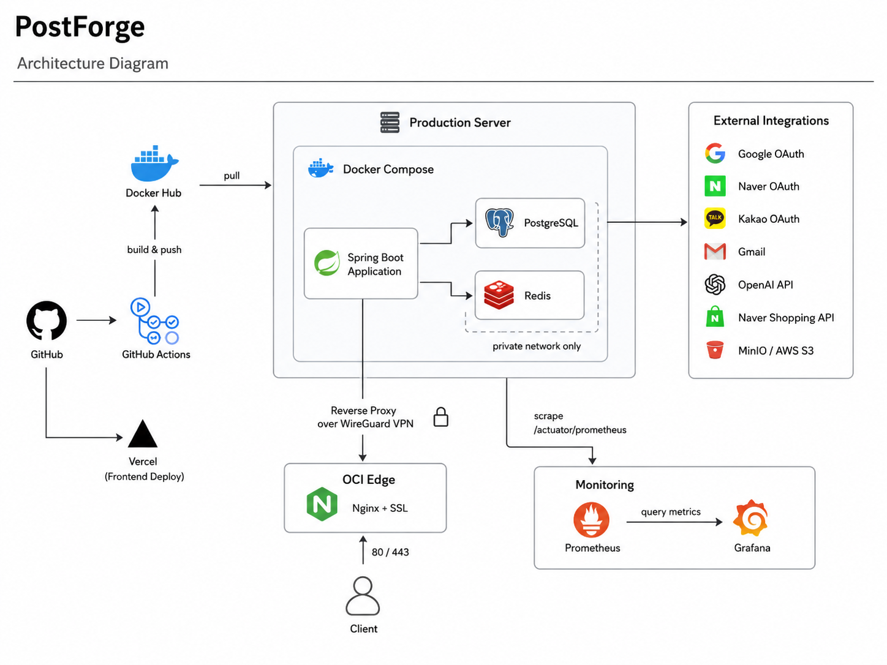

# PostForge

> Spring Boot 기반 멀티 모듈 커뮤니티 백엔드 + 신상품 출시 뉴스 수집/게시 + 가격 판정 커뮤니티

PostForge는 커뮤니티 게시판 위에 신상품 출시 뉴스 자동 포스팅, 가격 판정 기반,
출시 뉴스 구매 판단 투표를 결합한 백엔드입니다. 외부 상품 수집과 가격 이력은 보조 기반으로 유지하며,
공개 제품 흐름은 출시 뉴스와 사용자의 구매 판단을 돕는 데 초점을 둡니다.

## 핵심 기능

| 영역 | 현재 구현 |
| --- | --- |
| 인증 | JWT, Redis refresh token rotation, OAuth2, 이메일 인증, 로그인 보호 |
| 게시판 | 게시글, 댓글/대댓글, 좋아요, 조회수, S3 presigned URL, 작성자 소유권 검증 |
| 출시 뉴스 | Naver API HUB News 후보를 deterministic gate와 AI draft port로 처리해 `PRODUCT_LAUNCH_NEWS` 게시 |
| 가격 판정 | Naver Shopping 검색 종료로 대체 상품 소스 연결 전 `503` 반환 |
| 구매 판단 | 자동 게시된 출시 뉴스에 `BUYABLE`, `UNSURE`, `WAIT` 투표 |
| 상품 수집 | tracked keyword, collection job, raw product, catalog product, price snapshot |
| AI / RAG | Spring AI, OpenAI-compatible RAG 채팅, PgVector 문서 검색, 내부 출시뉴스 초안 생성 |
| 운영 기반 | Flyway baseline, Docker layered jar, 구조화 로그, Prometheus/Grafana |

가격 판정은 결과를 저장하지 않는 일회성 응답입니다. 계산식과 신뢰도 한계는
[통합 API 명세의 Price](./docs/api/README.md#price)를 기준으로 합니다.

## Architecture



11개 Gradle 모듈로 구성된 DDD-lite 모듈러 모놀리스입니다.

- `app`: 실행 조립과 route/security/OpenAPI 정책
- `core`: 모듈 간 port, DTO, 오류 및 principal 계약
- `support`: Redis, JPA auditing, 요청 로깅, 공통 MVC 예외 응답
- `auth`, `board`, `source`, `ingest`, `catalog`, `price`, `ai`, `messaging`: 기능별 소유권

기능 모듈은 서로의 구현 대신 port 또는 공개 application API를 사용하고, 의존성 방향은
`ModuleBoundaryTest`로 검증합니다.

- [모듈 책임과 의존 방향](./docs/architecture/module-dependencies.md)
- [모듈별 요청 처리 흐름](./docs/architecture/flows/README.md)
- [모듈러 모놀리스 선택과 MSA 전환 경로](./docs/decisions/adr-003-modular-monolith.md)

## Tech Stack

| 영역 | 기술 |
| --- | --- |
| Runtime | Java 21, Spring Boot 3.5.14, Gradle 8.14.3 |
| Data | PostgreSQL, PgVector, Redis, Spring Data JPA, Flyway |
| Security | Spring Security, JWT, OAuth2, Gmail SMTP |
| AI | Spring AI 1.0.7, OpenAI-compatible API, PgVector |
| Storage | S3-compatible storage |
| API | Spring MVC, SpringDoc OpenAPI |
| Test | JUnit 5, Spring Boot Test, ArchUnit |
| Operations | Docker Compose, GitHub Actions, Prometheus, Grafana, ECS JSON logging |

## Data And API

테이블·Redis key·S3 object 소유권은 [DB Schema Ownership](./docs/database/schema-ownership.md)이 정본입니다.
관계 시각화는 [MVP ERD](./docs/database/postforge-mvp-erd.md)와
[DBML](./docs/database/postforge-mvp-erd.dbml)을 봅니다.

신규 DB는 Flyway `V0000__baseline_schema.sql` 이후 증분 migration을 적용합니다.
운영 환경은 `ddl-auto=validate`로 entity와 schema의 일치만 검증합니다.

Endpoint, DTO, status, 인증 조건의 정본은 [API 명세](./docs/api/README.md)입니다.
실행 중에는 [Swagger UI](http://localhost:8080/swagger-ui.html)에서 현재 OpenAPI schema를 확인할 수 있습니다.

## Local Run

필수 도구는 Java 21+와 Docker Compose입니다. OAuth2, mail, S3, LLM, Naver API HUB를 사용하는 흐름에는
각 provider credential이 필요합니다.

```bash
cp .env.example .env
docker compose -f docker-compose.local.yml up -d
./gradlew :app:bootRun
```

전체 환경변수와 로컬 기본값은 [`.env.example`](./.env.example)을 정본으로 사용합니다.
실제 secret이 든 `.env`는 커밋하지 않습니다. `bootRun`은 루트 `.env`를 자동으로 읽습니다.

로컬 LLM을 사용할 때 애플리케이션은 OpenAI-compatible gateway를 거쳐 Ollama/Qwen을 호출합니다.
`LLM_CHAT_BASE_URL`에는 Ollama 자체 주소가 아니라 gateway 주소를 설정합니다.

```text
PostForge app
-> OpenAI-compatible LLM gateway
-> Ollama
-> Qwen model
```

`messaging`의 outbox relay는 기본 비활성화이며
`postforge.messaging.outbox.relay-enabled=true`일 때만 동작합니다.

## Test

```bash
# 전체 테스트
./gradlew test

# 통합 테스트 제외
./gradlew test -PexcludeTags=integration

# 실행 jar 생성
./gradlew :app:bootJar -PexcludeTags=integration
```

이 저장소에는 현재 전용 부하 테스트 runner가 없습니다. 과거 k6/Bruno/Grafana/API smoke 산출물은
[성능 리포트](./docs/performance/README.md)에 historical evidence로 보관합니다.
지표 해석·비용 계산 같은 학습 자료는 [문서 안내](./docs/README.md)에서 별도 분류하며 성능 증거로 사용하지 않습니다.

## Docker And Deployment

`release/postforge` 브랜치의 CI가 테스트 성공 후 Spring Boot layered jar 기반 runtime image를 만들고,
Docker Hub에 `latest`와 commit SHA tag로 게시합니다. `Dockerfile.runtime`은 non-root 사용자로 실행하며
dependency와 application layer를 분리해 registry cache 효율을 높입니다.

```text
GitHub push
-> ./gradlew check -PexcludeTags=integration
-> ./gradlew :app:bootJar
-> Dockerfile.runtime
-> Docker Hub latest + commit SHA
```

## 문서

| 문서 | 설명 |
| --- | --- |
| [전체 문서 안내](./docs/README.md) | 정본 경계, 읽는 순서, 전체 분류 |
| [포트폴리오 안내](./docs/portfolio/README.md) | 리뷰어 관점의 프로젝트 요약과 근거 |
| [API 명세](./docs/api/README.md) | 모듈별 endpoint, DTO, status, 인증 조건 |
| [모듈 의존성](./docs/architecture/module-dependencies.md) | 모듈 책임과 dependency policy |
| [DB Schema Ownership](./docs/database/schema-ownership.md) | DB/PgVector/Redis/S3 소유권과 migration 규칙 |
| [성능 리포트](./docs/performance/README.md) | 현재 검증 표면과 historical evidence 구분 |

## License

No license file is currently included. Reuse and distribution are controlled by the repository owner.
