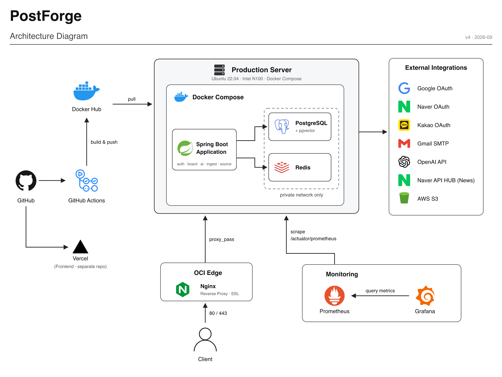

# PostForge

> 뉴스 수집·분류·LLM 초안 작성·스케줄 자동 게시 서비스

PostForge는 외부 뉴스를 수집하고 분야별로 선별한 뒤, LLM으로 본문·요약·태그 초안을 작성해 자동 게시하는 백엔드입니다.
정해진 스케줄에 뉴스 게시글을 발행하고, 매일 **06:00(Asia/Seoul)**에는 전날 게시된 뉴스를 분야별로 종합한 데일리 포스트를 자동 게시합니다.
메일 구독 서비스는 향후 확장 계획입니다.

## 핵심 기능

| 영역 | 현재 구현 |
| --- | --- |
| 뉴스 수집·자동 게시 | Google News RSS 검색 피드 수집(실험용), 중복·광고·출시 관련성 검사, LLM 초안 생성 후 게시 |
| 분야 분류 | 수집 키워드 또는 수동 요청의 분야를 게시글에 적용하고 분야별로 조회 |
| 데일리 포스트 | 전날 게시된 출시뉴스의 제목·요약을 LLM으로 종합해 분야별 게시글 생성 |
| 인증 | JWT, Redis refresh token rotation, OAuth2, 이메일 인증, 로그인 보호 |
| 게시판 | 게시글, 댓글/대댓글, 좋아요, 조회수, S3 presigned URL, 작성자 소유권 검증 |
| AI / RAG | Spring AI, OpenAI-compatible LLM, PgVector 문서 검색, 수집 자료에 대한 RAG 채팅 |
| 운영 기반 | Flyway baseline, Docker layered jar, 구조화 로그, Prometheus/Grafana |

이 브랜치의 수집원은 Google News RSS다. 스케줄러는 설정된 섹션(기본 `TECHNOLOGY,BUSINESS`)의 주제 피드를 키워드 없이 읽고, 게시글 분야는 Google 뉴스 한국판 섹션(대한민국·세계·비즈니스·과학/기술·엔터테인먼트·스포츠·건강)과 같다. 수동 게시는 키워드 검색 피드를 읽는다. 피드 자체가 개인·비상업 용도로 제한된다고 명시하므로 파이프라인 검증용이며 배포 소스가 아니다.
현재 수집·게시 정책은 신제품 출시뉴스를 대상으로 하며, 뉴스 글은 `PRODUCT_LAUNCH_NEWS`, 데일리 글은 `DAILY_DIGEST`로 저장합니다.
분야는 수집 설정에서 결정하고 LLM은 초안을 작성합니다. 스케줄 실행 안에서 수집부터 게시까지 처리하며, 초안을 별도 예약 대기열에 저장하지는 않습니다.
뉴스 자동 게시는 기본 매시 30분, 데일리는 매일 06:00이고 두 스케줄러는 기본 비활성입니다.
활성화 조건과 환경변수는 [자동 게시 스케줄](./docs/api/README.md#자동-게시-스케줄), 처리 과정은 [뉴스 처리 흐름](./docs/architecture/flows.md#ingest)을 봅니다.

## Architecture



다이어그램 원본은 [PostForge_Architecture_v4.svg](./docs/images/PostForge_Architecture_v4.svg)다.

8개 Gradle 모듈로 구성된 DDD-lite 모듈러 모놀리스입니다.

- `app`: 실행 조립과 route/security/OpenAPI 정책
- `core`: 모듈 간 port, DTO, 오류 및 principal 계약
- `support`: Redis, JPA auditing, 요청 로깅, 공통 MVC 예외 응답
- `auth`, `board`, `source`, `ingest`, `ai`: 기능별 소유권

기능 모듈은 서로의 구현 대신 port 또는 공개 application API를 사용하고, 의존성 방향은
`ModuleBoundaryTest`로 검증합니다.

- [모듈 책임과 의존 방향](./docs/architecture/module-dependencies.md)
- [모듈별 요청 처리 흐름](./docs/architecture/flows.md)
- [모듈러 모놀리스 선택과 MSA 전환 경로](./docs/decisions/adr-003-modular-monolith.md)
- [관측 스택 선택과 대안 비교](./docs/decisions/adr-006-observability-stack.md)

## Tech Stack

| 영역 | 기술 |
| --- | --- |
| Runtime | Java 21, Spring Boot 3.5.14, Gradle 8.14.3 |
| Data | PostgreSQL, PgVector, Redis, Spring Data JPA, Flyway |
| Security | Spring Security, JWT, OAuth2, Gmail SMTP |
| AI | Spring AI 1.0.7, OpenAI-compatible API, PgVector |
| Storage | S3-compatible storage |
| API | Spring MVC, SpringDoc OpenAPI |
| Test | JUnit 5, Spring Boot Test, ArchUnit |
| Operations | Docker Compose, GitHub Actions, Prometheus, Grafana, ECS JSON logging |

## Data And API

테이블·Redis key·S3 object 소유권은 [DB Schema Ownership](./docs/database/schema-ownership.md)이 정본입니다.
관계 시각화는 [MVP ERD](./docs/database/postforge-mvp-erd.md)를 봅니다.

신규 DB는 Flyway `V0000__baseline_schema.sql` 하나로 만듭니다. 2026-09-30 뉴스 도메인을 떠나는 시점([ADR-007](./docs/decisions/adr-007-remove-naver-news-source.md))에 이력을 리셋했으므로,
옛 이력이 적용된 DB는 고쳐 쓰지 않고 DB를 지우고 다시 만듭니다. 로컬은 `docker exec postforge-db sh -c 'psql -U "$POSTGRES_USER" -d postgres -c "drop database postforge" -c "create database postforge"'` 뒤 재기동, 계정·게시글은 `scripts/local-demo-seed.sql`로 다시 넣습니다.
모든 프로필은 `ddl-auto=validate`로 entity와 schema의 일치만 검증합니다.

Endpoint, DTO, status, 인증 조건의 정본은 [API 명세](./docs/api/README.md)입니다.
관리자 권한은 기존 ADMIN이 `PUT /api/admin/accounts/{accountId}/roles/admin`으로 다른 활성 계정에 부여할 수 있습니다.
최초 ADMIN은 DB에서 지정해야 하며, 승격된 계정은 다시 로그인하거나 토큰을 재발급받아야 합니다.
실행 중에는 [Swagger UI](http://localhost:8080/swagger-ui.html)에서 현재 OpenAPI schema를 확인할 수 있습니다.

## Local Run

필수 도구는 Java 21+, Docker Compose, [Ollama](https://ollama.com)입니다.

설정은 세 층입니다. `application.yml`은 공통이고, `application-local.yml`·`application-prod.yml`에는 환경마다 값이
달라야 하는 항목(DB·Redis 호스트, LLM 주소·모델 기본값, 메일 서버, 프록시 헤더)만 둡니다. 프로필을 지정하지 않으면
`local`이며, 운영은 `SPRING_PROFILES_ACTIVE=prod`로 바꿉니다.

| | local | prod |
| --- | --- | --- |
| 프로필 설정 | `application-local.yml` (커밋) | `application-prod.yml` (커밋 안 함, 배포 호스트에서 컨테이너에 마운트) |
| 환경변수 | `.env.local` (커밋 안 함) | `.env` (커밋 안 함, compose `env_file`) |
| compose | `docker-compose.local.yml` (커밋) | `docker-compose.prod.yml` (커밋 안 함) |

[`.env.example`](./.env.example)은 두 환경에서 쓰는 변수명만 값 없이 나열합니다. 로컬은 주소·DB 계정·JWT·소셜 로그인·S3·
모니터링 값만 채우면 됩니다. Google News RSS는 키가 없고 `GOOGLE_NEWS_ENABLED=true`로 켭니다. LLM 주소·모델, Redis 호스트, 메일 서버는 `application-local.yml` 기본값
(Ollama `localhost:11434`의 `qwen3:8b`·`bge-m3`, Redis `localhost`, Mailpit `localhost:1025`)을 쓰므로 비워 둡니다.

```bash
cp .env.example .env.local                                               # 값 채우기
ollama pull qwen3:8b && ollama pull bge-m3
docker compose --env-file .env.local -f docker-compose.local.yml up -d   # PostgreSQL(pgvector), Redis, Mailpit
./gradlew :app:bootRun                                                   # 프로필 local, 루트의 .env.local 을 읽음
```

첫 부팅 시 Flyway가 `db/migration`의 baseline(V0000)부터 적용해 스키마를 만들고, Hibernate는 `validate`로
엔티티와 스키마가 일치하는지만 검사합니다. 부팅 확인은 `curl localhost:8080/actuator/health`.
인증 메일은 실제로 발송되지 않고 [Mailpit](http://localhost:8025)에 쌓입니다. 데모 계정과 게시글은 `scripts/local-demo-seed.sql`로 넣습니다.

LLM은 로컬에서 Ollama를 직접 호출하고 운영에서는 OpenAI-compatible gateway를 거칩니다. 두 환경 모두 공용 주소
`LLM_GATEWAY_BASE_URL`/`LLM_GATEWAY_TOKEN`과, 그보다 우선하는 개별 주소 `LLM_CHAT_BASE_URL`/`LLM_CHAT_API_KEY`,
`LLM_EMBEDDING_BASE_URL`/`LLM_EMBEDDING_API_KEY`로 덮어쓸 수 있습니다. 운영은 기본값이 없어 `LLM_GATEWAY_BASE_URL`,
`LLM_CHAT_MODEL`, `LLM_EMBEDDING_MODEL`이 빠지면 기동에 실패합니다. 임베딩 차원 `1024`는 `vector_store` 스키마와 묶여 있으므로 유지합니다.

```text
local: PostForge app -> Ollama(localhost:11434) -> qwen3:8b (chat) / bge-m3 (embedding)
prod:  PostForge app -> OpenAI-compatible LLM gateway -> Ollama -> qwen3:8b / bge-m3
```

운영 배포 호스트에는 `docker-compose.prod.yml`, `.env`, `application-prod.yml`을 같은 디렉터리에 둡니다. compose가
`application-prod.yml`을 `/app/config/`에 마운트하므로 이미지를 다시 만들지 않고 설정을 바꿀 수 있습니다.
`.env`는 예제가 바뀌어도 자동 갱신되지 않으므로 배포 시 새 항목만 병합하고 기존 비밀키는 유지합니다.
두 파일을 바꾼 뒤에는 앱 컨테이너를 재생성해야 반영됩니다.

## Test

```bash
# 전체 테스트
./gradlew test

# 통합 테스트 제외
./gradlew test -PexcludeTags=integration

# 실행 jar 생성
./gradlew :app:bootJar -PexcludeTags=integration
```

이 저장소에는 현재 전용 부하 테스트 runner가 없습니다. 과거 k6/Bruno/Grafana/API smoke 산출물은
[성능 리포트](./docs/performance/README.md)에 historical evidence로 보관합니다.

## Docker And Deployment

`release/postforge` 브랜치의 CI가 테스트 성공 후 Spring Boot layered jar 기반 runtime image를 만들고,
Docker Hub에 `latest`와 commit SHA tag로 게시합니다. `Dockerfile.runtime`은 non-root 사용자로 실행하며
dependency와 application layer를 분리해 registry cache 효율을 높입니다.

```text
GitHub push
-> ./gradlew check -PexcludeTags=integration
-> ./gradlew :app:bootJar
-> Dockerfile.runtime
-> Docker Hub latest + commit SHA
```

## 문서

| 문서 | 설명 |
| --- | --- |
| [전체 문서 안내](./docs/README.md) | 정본 경계, 읽는 순서, 전체 분류 |
| [API 명세](./docs/api/README.md) | 모듈별 endpoint, DTO, status, 인증 조건 |
| [모듈 의존성](./docs/architecture/module-dependencies.md) | 모듈 책임과 dependency policy |
| [DB Schema Ownership](./docs/database/schema-ownership.md) | DB/PgVector/Redis/S3 소유권과 migration 규칙 |
| [성능 리포트](./docs/performance/README.md) | 현재 검증 표면과 historical evidence 구분 |

## License

No license file is currently included. Reuse and distribution are controlled by the repository owner.

