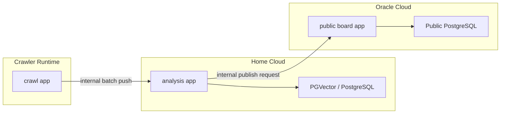
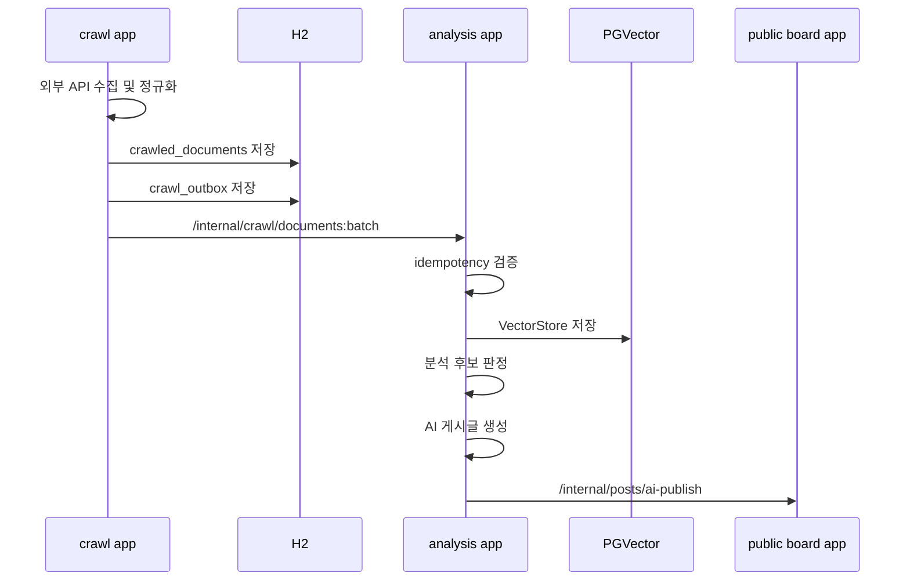

# Crawl Redesign Architecture

## 목적

현재 `crawl` 모듈은 수집기 역할을 넘어서 AI 문서 저장과 게시글 생성 트리거까지 직접 담당하고 있다.
이 구조는 책임이 섞여 있고, 전송 실패 시 재처리와 복구가 어렵다.

목표 구조는 아래와 같다.

- `crawl`은 외부 데이터 수집, 정규화, 중복 제거, 로컬 영속화만 담당한다.
- 메인 분석 앱은 수집 문서를 받아 PGVector에 저장하고 AI 분석 및 게시글 생성을 담당한다.
- 게시판 앱은 최종 게시글 저장과 사용자 요청 처리만 담당한다.

## 현재 구조의 문제

- `crawl`이 AI 엔드포인트(`/ai/documents`, `/ai/posts/generate`)를 직접 호출한다.
- H2 저장이 AI 전송 성공에 종속되어 있어, 수집 성공 사실을 안정적으로 남기지 못한다.
- `crawl`이 게시글 생성 시점과 정책까지 알아야 해서 모듈 경계가 흐려진다.
- 장애 시 어떤 단계에서 실패했는지 추적하기 어렵고, 안전한 재전송 경로가 없다.

## 설계 원칙

- 수집과 분석, 발행을 분리한다.
- 저장 후 전송한다.
- 전송은 멱등하게 만든다.
- 내부 통신은 인증된 internal API로 제한한다.
- 재시도 가능한 단계와 사람이 개입해야 하는 단계를 명확히 분리한다.

## 권장 배포 구조



## 권장 코드 구조

### 실행 단위

- `crawl-app`
  - 외부 API 수집기
  - H2 저장소
  - outbox relay
- `analysis-app`
  - 수집 문서 수신 internal API
  - PGVector 적재
  - 분석 orchestrator
  - AI 게시글 생성
- `public-app`
  - 게시판, 인증, 파일, 사용자 공개 API
  - AI 생성 게시글 저장용 internal publish API

### Gradle 모듈 제안

- `core`
  - 공용 DTO, 내부 포트, 공통 에러
- `crawl`
  - 외부 수집, 정규화, dedupe, H2, outbox
- `ingest` 신규
  - 수집 문서 수신 API, idempotency, ingestion orchestration
- `ai`
  - VectorStore 저장, 문서 검색, 프롬프트 조립, 생성
- `board`
  - 게시글 영속화, 조회, 공개 API
- `app-public` 신규 또는 기존 `app` 재정의
  - `board`, `auth`, 필요 공용 모듈 조립
- `app-analysis` 신규
  - `ingest`, `ai`, 필요 공용 모듈 조립

## 모듈 책임

### crawl

- 네이버 뉴스, DART 호출
- 수집 결과 정규화
- dedupe key 계산
- 중복 검증
- `crawled_documents` 저장
- 같은 트랜잭션 안에서 `crawl_outbox` 적재
- relay가 analysis app에 전송

`crawl`은 아래를 몰라야 한다.

- PGVector 저장 방식
- AI 프롬프트
- 게시글 생성 시점
- 게시글 발행 정책

### ingest

- `crawl`이 보낸 문서 배치를 수신한다.
- request schema 검증
- idempotency key 검증
- 문서를 analysis 도메인 이벤트로 변환한다.
- 수집 문서를 `ai` 모듈로 넘긴다.

### ai

- 수집 문서를 Spring AI `Document`로 변환한다.
- PGVector에 저장한다.
- 정기공시 등 특정 조건에서 분석 후보를 만든다.
- 관련 문서를 검색해서 게시글 초안을 생성한다.

### board

- 최종 게시글을 저장한다.
- 공개 API는 기존과 동일하게 유지한다.
- internal publish API를 통해 analysis app의 발행 요청을 받는다.

## 데이터 모델 제안

### crawl H2

#### `crawled_documents`

- `id`
- `source`
- `source_type`
- `external_id`
- `original_link`
- `dedupe_key`
- `content_hash`
- `title`
- `content`
- `summary`
- `keyword`
- `stock_code`
- `corp_name`
- `published_at`
- `crawl_status`
- `created_at`

권장 unique 제약

- `original_link`
- 또는 `source + external_id`
- 보조적으로 `dedupe_key`

#### `crawl_outbox`

- `id`
- `document_id`
- `event_type`
- `payload_json`
- `delivery_status`
- `attempt_count`
- `last_error`
- `next_retry_at`
- `sent_at`
- `created_at`

상태 예시

- `PENDING`
- `SENDING`
- `SENT`
- `FAILED`
- `DEAD_LETTER`

### analysis 측 idempotency

#### `ingested_documents`

- `idempotency_key`
- `source`
- `external_id`
- `ingested_at`
- `vector_document_id`

## 내부 API 제안

### 1. crawl -> analysis

`POST /internal/crawl/documents:batch`

요청 예시:

```json
{
  "batchId": "crawl-2026-04-11T10:00:00Z-001",
  "documents": [
    {
      "idempotencyKey": "naver-news:https://example.com/news/1",
      "source": "naver-news",
      "sourceType": "NEWS",
      "externalId": "https://example.com/news/1",
      "originalLink": "https://example.com/news/1",
      "title": "기사 제목",
      "content": "정규화된 본문",
      "summary": "설명 요약",
      "publishedAt": "2026-04-11T09:00:00+09:00",
      "metadata": {
        "keyword": "주식"
      }
    }
  ]
}
```

응답 예시:

```json
{
  "accepted": 1,
  "duplicates": 0,
  "failed": 0
}
```

### 2. analysis -> public board

`POST /internal/posts/ai-publish`

요청 예시:

```json
{
  "idempotencyKey": "ai-post:dart:005930:2026-04-11",
  "title": "삼성전자 공시 분석",
  "summary": "실적과 시장 반응 요약",
  "content": "마크다운 본문",
  "tags": ["삼성전자", "DART", "실적분석"],
  "authorId": "ai-post-generator",
  "authorNickname": "AI 분석가"
}
```

## 이벤트 흐름



## 추천 기술 선택

### 유지 추천

- `RestClient` 또는 HTTP Interface
  - 내부 API 호출용으로 충분하다.
- Spring AI + PGVector
  - 현재 요구사항과 가장 잘 맞는다.

### 추가 추천

- Spring Modulith
  - `ingest -> analysis -> publish` 경계를 모듈과 이벤트로 정리하기 좋다.
- Spring Retry 또는 Resilience4j Retry
  - outbox relay 재시도 정책에 적합하다.
- ShedLock
  - relay 스케줄러가 다중 인스턴스로 뜰 가능성이 있으면 권장한다.

### 지금은 보류 추천

- Kafka, RabbitMQ
  - 현재 규모에서는 운영 부담이 더 크다.
- Spring Integration
  - 내부 흐름이 더 복잡해질 때 재검토한다.
- Spring Batch
  - 백필 작업이나 대량 재처리가 필요해질 때 도입한다.

## 구현 방향

### 1단계: 경계 분리

- `crawl`에서 `AiDocumentSender` 제거
- `MainAppIngestionClient` 또는 `AnalysisIngestionClient`로 교체
- `/ai/documents`, `/ai/posts/generate` 직접 호출 제거
- `triggerPostGeneration()` 제거

### 2단계: 저장 우선 구조 도입

- `crawled_documents`와 `crawl_outbox` 추가
- AI 전송 성공 여부와 무관하게 수집 사실부터 저장
- relay 스케줄러 추가

### 3단계: analysis app 추가

- `app-analysis` 생성
- `ingest` 모듈 추가
- PGVector 적재 API 추가
- 정기공시 분석 orchestrator 추가

### 4단계: publish 경계 분리

- public board app에 internal publish API 추가
- `PostWriter`는 board 내부 구현으로 유지
- analysis app은 internal API를 통해 발행만 요청

## 기존 클래스 변경 포인트

- `crawl/common/AiDocumentSender`
  - 삭제 또는 `AnalysisIngestionClient`로 교체
- `crawl/service/NaverNewsCrawlService`
  - AI 문서 전송 대신 수집 문서 저장 + outbox 발행
- `crawl/service/DartCrawlService`
  - 재무 문서도 동일하게 수집 결과로 저장
  - 게시글 생성 트리거 제거
- `ai/document/service/DocumentService`
  - 외부 공개 저장 엔드포인트 뒤가 아니라 ingest 모듈 뒤에서 호출되게 이동
- `ai/post/service/PostGenerationService`
  - 외부 요청 진입점보다는 내부 orchestrator에서 호출되게 조정

## 운영 고려사항

- internal API는 `X-Internal-Api-Key`보다 mTLS 또는 VPN 제한과 함께 쓰는 편이 안전하다.
- relay 실패는 재시도 횟수와 dead letter 상태를 남겨야 한다.
- 게시글 자동 발행 전에는 `draft` 모드를 둘 수 있다.
- 정기공시만 auto publish, 뉴스는 ingest only 같은 정책 분리가 가능해야 한다.

## 추천 마이그레이션 순서

1. DTO와 internal API 명세 확정
2. crawl outbox 도입
3. analysis ingestion API 구현
4. crawl direct AI 호출 제거
5. publish API 분리
6. 배포 topology 분리

## 참고 문서

- Spring Modulith: https://docs.spring.io/spring-modulith/reference/
- Spring REST Clients: https://docs.spring.io/spring-framework/reference/integration/rest-clients.html
- Spring AI PGVector: https://docs.spring.io/spring-ai/reference/api/vectordbs/pgvector.html
- Transactional Outbox pattern: https://microservices.io/patterns/data/transactional-outbox.html

## 로컬 주석 기준 즉시 정리 후보

현재 로컬 변경 파일에서 아래 주석을 확인했다.

- `crawl/candidate/config/CandidateConfig.java`
  - `disclosureLookbackHours`, `priceChangeThreshold`, `volumeRatioThreshold` 역할 설명 필요
  - 권장: `@ConfigurationProperties` 설명 주석 또는 별도 후보 선정 문서 추가
- `crawl/candidate/service/CandidateSelector.java`
  - `Clock` 주입 의도는 좋지만 생성자 주석을 정리하고 테스트 가능성 관점으로 설명하는 편이 낫다
- `crawl/dart/service/DartCrawlService.java`
  - 상수 묶음이 커져서 enum 또는 value object 분리가 필요하다
  - 특히 공시 유형, 보고서 코드, 소스명은 별도 타입으로 추출하는 편이 좋다
- `crawl/common/entity/CrawledArticle.java`
  - `@PrePersist`보다 공용 auditing 베이스 도입이 더 자연스럽다
  - 다만 outbox 및 delivery 상태 컬럼이 추가될 예정이므로 단순 auditing 추출과 함께 엔티티 책임도 재정리하는 편이 좋다

즉, 현재 주석은 단순 스타일 이슈보다도 구조 개편과 함께 정리하는 것이 맞다.
특히 `DartCrawlService`와 `CrawledArticle`은 이번 재설계의 직접 영향권에 있다.
