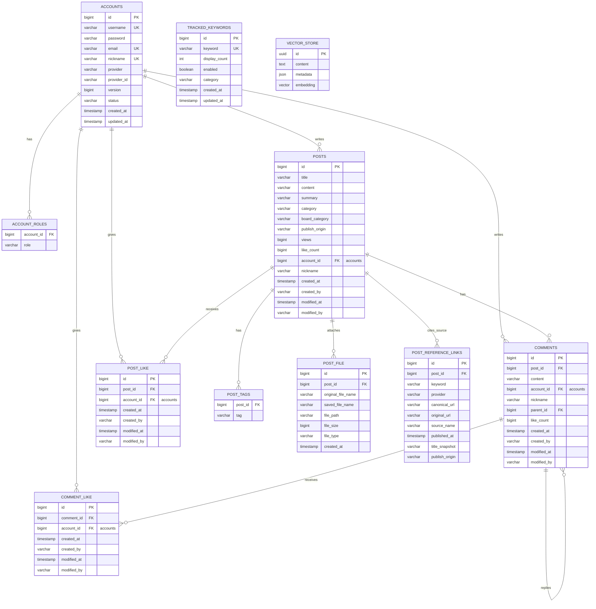

# PostForge MVP ERD

> Current status: 현재 구현을 시각화한 derived document다.
> Table ownership과 물리 schema의 기준은 [DB Schema Ownership](./schema-ownership.md)이다.

이 문서는 현재 relational/PgVector schema의 관계, 컬럼, index를 ERD 관점으로 보여준다. 자동 수집 뉴스와 데일리 요약은 별도 테이블이 아니라 `posts.category`의 `PRODUCT_LAUNCH_NEWS`와 `DAILY_DIGEST`로 구분하고, 수집 분야는 `posts.board_category`에 기록한다. 향후 메일 구독 schema는 아직 없다.

## ERD

## Index Targets

| Query | Index Candidate |
| --- | --- |
| 게시글 최신순 | `posts(created_at)` |
| 작성자 게시글 | `posts(account_id)` |
| 게시글 유형 필터 | `posts(category)` |
| 분야 필터 | `posts(board_category)` |
| 발행 출처 필터 | `posts(publish_origin)` |
| 댓글 조회 | `comments(post_id, created_at)` |
| 대댓글 조회 | `comments(parent_id)` |
| 뉴스 자동 수집 대상 | `tracked_keywords(keyword)` unique |
| 게시글별·provider별 뉴스 출처 조회 | `post_reference_links(post_id)`, `post_reference_links(provider)` |
| 기사 URL 중복 게시 방지 | `post_reference_links(canonical_url)` unique |
| 중복 좋아요 방지 | `post_like(post_id, account_id)`, `comment_like(comment_id, account_id)` unique |
