# PostForge MVP ERD

> Current status: 현재 구현 기준 code-backed ERD다.
> Last verified against code: 2026-06-25.
> 세부 ownership source of truth는 [DB Schema Ownership](./schema-ownership.md)이고, 시각화용 DBML은 [postforge-mvp-erd.dbml](./postforge-mvp-erd.dbml)이다.

이 문서는 현재 PostForge modular monolith가 실제로 저장하는 relational/PgVector schema를 ERD 관점으로 정리한다.
이전 키워드 이메일 알림 중심 설계는 현재 구현 schema가 아니라 historical draft로 본다.

## MVP 제품 문장

PostForge는 외부 상품/뉴스 source를 조회하고, 상품 수집 결과를 내부 catalog로 정규화하며, 가격 이력을 foundation으로 보관한다. 공개 제품 방향은 신상품 출시 뉴스 자동 게시, response-only 가격 판정, 구매 판단 투표가 붙은 커뮤니티 백엔드다.

현재 schema가 보여주는 핵심 역량은 다음이다.

- `source`는 외부 API client와 실행 계약을 소유하지만 DB table은 소유하지 않는다.
- `ingest`는 추적 키워드, 수집 job, 원본 상품 payload를 저장한다.
- `catalog`는 정규화된 상품, offer, product matching, product embedding을 소유한다.
- `price`는 수집 시점별 가격 snapshot history를 소유한다.
- `board`는 게시글/댓글/좋아요/파일에 더해 상품-게시글 link를 소유한다.
- `ai`는 RAG용 Spring AI `vector_store`를 소유하고, `catalog`의 `product_embeddings`와 분리된다.
- `messaging`은 현재 DB table 없이 in-process event dispatch만 담당한다.

## Scope

### Included

| Area | Tables | Purpose |
| --- | --- | --- |
| auth | `accounts`, `account_roles` | 사용자 identity, OAuth provider identity, role set |
| board | `posts`, `post_tags`, `comments`, `post_like`, `comment_like`, `post_file`, `post_product_links`, `post_reference_links`, `post_purchase_vote` | 커뮤니티 게시판, 파일 metadata, 상품 게시글 link, 출시 뉴스 evidence, 구매 판단 투표 |
| ingest | `tracked_keywords`, `collection_jobs`, `raw_products` | 수집 대상 키워드, 실행 단위 상태, 외부 API 원본 payload |
| catalog | `product_categories`, `products`, `offers`, `product_embeddings`, `product_match_candidates` | 상품 표준 모델, source/mall별 offer, matching vector와 후보 |
| price | `price_snapshots` | offer별 가격 이력과 프론트 가격 그래프 원천 데이터 |
| ai | `vector_store` | Spring AI PgVectorStore가 관리하는 RAG document embeddings |

### Deferred / Target Only

| Deferred Area | Reason |
| --- | --- |
| notification | `keyword_subscriptions`, `notification_events`, `email_delivery_logs`는 아직 구현 table이 아니다. |
| workspace | private report workspace는 target 후보이며 현재 schema에는 없다. |
| billing | plan/subscription/quota table은 target 후보이며 현재 schema에는 없다. |
| post ranking | `post_rank_scores`는 추천/랭킹 확장 시 다시 검토한다. `post_reference_links`는 출시 뉴스 evidence로 현재 board 소유 범위에 포함된다. |

## Boundary Rules

- 하나의 table은 하나의 owning module만 갖는다.
- 다른 module의 id를 저장하는 column은 대부분 scalar logical reference이며, 실제 JPA relation/FK와 구분한다.
- `board.account_id`, `comment.account_id`, like의 `account_id`는 `auth.accounts.id`에 대한 logical reference다.
- `board.post_product_links.product_id`, `price.product_id`, `price.offer_id`는 catalog id에 대한 logical reference다.
- PgVector는 두 용도로 분리한다. `ai.vector_store`는 RAG document, `catalog.product_embeddings`는 product matching 용도다.

## ERD

```mermaid
erDiagram
    ACCOUNTS ||--o{ ACCOUNT_ROLES : has

    POSTS ||--o{ POST_TAGS : has
    POSTS ||--o{ COMMENTS : has
    COMMENTS ||--o{ COMMENTS : replies
    POSTS ||--o{ POST_LIKE : receives
    COMMENTS ||--o{ COMMENT_LIKE : receives
    POSTS ||--o{ POST_FILE : attaches
    POSTS ||--o{ POST_PRODUCT_LINKS : links_product
    POSTS ||--o{ POST_REFERENCE_LINKS : cites_source
    POSTS ||--o{ POST_PURCHASE_VOTE : receives_vote

    COLLECTION_JOBS ||--o{ RAW_PRODUCTS : produces

    PRODUCT_CATEGORIES ||--o{ PRODUCTS : categorizes
    PRODUCTS ||--o{ OFFERS : has
    PRODUCTS ||--|| PRODUCT_EMBEDDINGS : embeds
    PRODUCTS ||--o{ PRODUCT_MATCH_CANDIDATES : logical_candidate
    PRODUCTS ||--o{ PRICE_SNAPSHOTS : logical_product
    OFFERS ||--o{ PRICE_SNAPSHOTS : logical_offer
    PRODUCTS ||--o{ POST_PRODUCT_LINKS : logical_board_link

    ACCOUNTS {
        bigint id PK
        varchar username UK
        varchar password
        varchar email UK
        varchar nickname UK
        varchar provider
        varchar provider_id
        bigint version
        varchar status
        timestamp created_at
        timestamp updated_at
    }

    ACCOUNT_ROLES {
        bigint account_id FK
        varchar role
    }

    POSTS {
        bigint id PK
        varchar title
        varchar content
        varchar summary
        varchar category
        varchar board_category
        varchar publish_origin
        bigint views
        bigint like_count
        bigint account_id "logical auth ref"
        varchar nickname
        timestamp created_at
        varchar created_by
        timestamp modified_at
        varchar modified_by
    }

    POST_TAGS {
        bigint post_id FK
        varchar tag
    }

    COMMENTS {
        bigint id PK
        bigint post_id FK
        varchar content
        bigint account_id "logical auth ref"
        varchar nickname
        bigint parent_id FK
        bigint like_count
        timestamp created_at
        varchar created_by
        timestamp modified_at
        varchar modified_by
    }

    POST_LIKE {
        bigint id PK
        bigint post_id FK
        bigint account_id "logical auth ref"
        timestamp created_at
        varchar created_by
        timestamp modified_at
        varchar modified_by
    }

    COMMENT_LIKE {
        bigint id PK
        bigint comment_id FK
        bigint account_id "logical auth ref"
        timestamp created_at
        varchar created_by
        timestamp modified_at
        varchar modified_by
    }

    POST_FILE {
        bigint id PK
        bigint post_id FK
        varchar original_file_name
        varchar saved_file_name
        varchar file_path
        bigint file_size
        varchar file_type
        timestamp created_at
    }

    POST_REFERENCE_LINKS {
        bigint id PK
        bigint post_id FK
        varchar keyword
        bigint product_id "logical catalog ref"
        varchar provider
        varchar canonical_url
        varchar original_url
        varchar source_name
        timestamp published_at
        varchar title_snapshot
        varchar publish_origin
    }

    POST_PURCHASE_VOTE {
        bigint id PK
        bigint post_id FK
        bigint account_id "logical auth ref"
        varchar vote_type
        timestamp created_at
        varchar created_by
        timestamp modified_at
        varchar modified_by
    }

    POST_PRODUCT_LINKS {
        bigint id PK
        bigint post_id FK
        bigint product_id "logical catalog ref"
        date post_date
        timestamp created_at
    }

    TRACKED_KEYWORDS {
        bigint id PK
        varchar keyword
        varchar source
        int interval_minutes
        int display_count
        boolean enabled
        timestamp created_at
        timestamp updated_at
    }

    COLLECTION_JOBS {
        bigint id PK
        bigint tracked_keyword_id "logical ingest ref"
        varchar source
        varchar keyword
        varchar status
        timestamp requested_at
        timestamp started_at
        timestamp finished_at
        int collected_count
        varchar failure_reason
        int retry_count
    }

    RAW_PRODUCTS {
        bigint id PK
        bigint collection_job_id FK
        varchar source
        varchar external_product_id
        text raw_payload
        timestamp collected_at
    }

    PRODUCT_CATEGORIES {
        bigint id PK
        varchar name UK
        bigint parent_id
        int depth
        timestamp created_at
        timestamp updated_at
    }

    PRODUCTS {
        bigint id PK
        varchar source
        varchar external_product_id
        varchar name
        varchar normalized_name
        varchar brand
        varchar maker
        bigint category_id FK
        varchar category1
        varchar category2
        varchar category3
        bigint current_price
        varchar image_url
        varchar product_url
        varchar mall_name
        varchar status
        timestamp created_at
        timestamp updated_at
    }

    OFFERS {
        bigint id PK
        bigint product_id FK
        varchar source
        varchar external_product_id
        varchar mall_name
        varchar title
        varchar product_url
        varchar image_url
        boolean active
        timestamp created_at
        timestamp updated_at
    }

    PRODUCT_EMBEDDINGS {
        bigint product_id PK
        text embedding_input
        vector embedding
        timestamp created_at
        timestamp updated_at
    }

    PRODUCT_MATCH_CANDIDATES {
        bigint id PK
        bigint source_product_id "logical catalog ref"
        varchar source
        varchar external_product_id
        varchar source_product_title
        bigint candidate_product_id "logical catalog ref"
        numeric similarity_score
        boolean brand_matched
        boolean category_matched
        varchar status
        timestamp created_at
        timestamp updated_at
    }

    PRICE_SNAPSHOTS {
        bigint id PK
        bigint product_id "logical catalog ref"
        bigint offer_id "logical catalog ref"
        varchar source
        varchar external_product_id
        bigint price
        timestamp collected_at
    }

    VECTOR_STORE {
        uuid id PK
        text content
        json metadata
        vector embedding
    }
```



## Table Roles

### accounts / account_roles

`auth`가 소유하는 identity와 role set이다.
`accounts.username`, `email`, `nickname`, `(provider, provider_id)`가 unique constraint를 가진다.
다른 모듈은 `account_id`를 scalar로 저장할 수 있지만, auth table을 직접 갱신하지 않는다.

### posts / comments / likes / files / tags

`board`의 기본 커뮤니티 schema다.
`Post`, `Comment`, `PostLike`, `CommentLike`는 board 내부 relation만 JPA relation으로 둔다.
작성자 식별자는 `account_id`와 `nickname` snapshot으로 저장한다.

### post_product_links

게시글과 catalog product id를 연결하는 board 확장이다.
가격 이력 조회와 독립적으로 상품 상세에서 관련 게시글을 보여주는 데 사용한다.

### tracked_keywords / collection_jobs / raw_products

`ingest`가 소유하는 상품 수집 실행 상태다.
`tracked_keywords`는 scheduler 대상이고, `collection_jobs`는 실행 단위이며, `raw_products`는 provider payload 보관소다.

### product_categories / products / offers

`catalog`가 소유하는 정규화 상품 truth다.
`products(source, external_product_id)`와 `offers(source, external_product_id)`는 source별 중복 upsert 기준이다.

### product_embeddings / product_match_candidates

`product_embeddings`는 `ProductEmbeddingSchemaInitializer`가 직접 만드는 pgvector table이다.
Spring AI `VectorStore`가 쓰는 `vector_store`와 별개이며, product matching 후보 조회와 수동 승인 흐름을 위한 catalog 내부 저장소다.

### price_snapshots

`price`가 소유하는 수집 시점별 가격 이력이다.
`product_id`, `offer_id`는 catalog id에 대한 logical reference로 저장하고, cross-module FK를 두지 않는다.

### vector_store

`ai`가 소유하는 Spring AI PgVectorStore 기본 table이다.
문서 chunk/RAG 검색용이며, product matching용 `product_embeddings`와 schema owner가 다르다.

## Main Flows

### 1. Product Collection

```text
tracked_keywords
-> collection_jobs
-> source product client
-> raw_products
```

`source`는 외부 API client를 제공하고, `ingest`는 실행 상태와 원본 payload를 저장한다.

### 2. Catalog Upsert And Matching

```text
raw_products
-> products / offers
-> product_embeddings
-> product_match_candidates
```

정규화된 상품은 catalog에 저장하고, embedding similarity가 애매한 경우 match candidate로 남긴다.

### 3. Price Tracking

```text
offers
-> price_snapshots
```

가격 수집 결과는 상승/하락 이벤트로 해석하지 않고 이력으로 남긴다.

### 4. Product-Linked Posts

```text
-> posts
-> post_product_links
```

상품 상세에서 관련 게시글을 조회할 수 있도록 게시글과 상품 id를 연결한다.
현재 구현은 모듈 간 id를 logical reference로 이어 두고, cross-module table FK를 만들지 않는다.

### 5. RAG Document Ingest

```text
ingest document pipeline
-> Spring AI VectorStore
-> vector_store
```

문서 검색용 PgVector storage는 `ai`가 소유하고, `ingest`는 현재 monolith 단계에서 `VectorStore` API를 통해 문서를 제출한다.

## Index Targets

| Query | Index Candidate |
| --- | --- |
| 게시글 최신순 | `posts(created_at)` |
| 작성자 게시글 | `posts(account_id)` |
| 게시글 유형 필터 | `posts(category)` |
| 게시판 카테고리 필터 | `posts(board_category)` |
| 발행 출처 필터 | `posts(publish_origin)` |
| 댓글 조회 | `comments(post_id, created_at)` |
| 대댓글 조회 | `comments(parent_id)` |
| 중복 좋아요 방지 | `post_like(post_id, account_id)`, `comment_like(comment_id, account_id)` unique |
| 상품 수집 대상 중복 방지 | `tracked_keywords(source, keyword)` unique |
| product upsert | `products(source, external_product_id)` unique |
| offer upsert | `offers(source, external_product_id)` unique |
| product name search/matching | `products(normalized_name)`, `product_embeddings(embedding)` |
| price history | `price_snapshots(product_id, collected_at)`, `price_snapshots(offer_id, collected_at)` |

## Future Extension Boundary

다음 기능은 현재 code-backed ERD에 넣지 않고 target 후보로만 둔다.

- notification: `keyword_subscriptions`, `notification_events`, `email_delivery_logs`
- workspace: `workspaces`, `workspace_members`, `drafts`, `draft_sources`
- billing: `subscription_plans`, `account_subscriptions`
- board ranking: `post_rank_scores`. `post_reference_links`는 출시 뉴스 evidence로 현재 board ownership에 포함한다.
- AI cost control: `ai_budget_windows`, `ai_usage_logs`
- external MQ broker: Kafka/RabbitMQ/SQS publisher adapter
