# PostForge MVP ERD

> Current status: 현재 구현을 시각화한 derived document다.
> Table ownership과 물리 schema의 기준은 [DB Schema Ownership](./schema-ownership.md), DBML은 [postforge-mvp-erd.dbml](./postforge-mvp-erd.dbml)이다.

이 문서는 현재 relational/PgVector schema의 관계, 컬럼, index를 ERD 관점으로 보여준다.
Owner, target schema 후보, migration 규칙은 중복하지 않고 [DB Schema Ownership](./schema-ownership.md)에만 둔다.

## ERD

```mermaid
erDiagram
    ACCOUNTS ||--o{ ACCOUNT_ROLES : has

    POSTS ||--o{ POST_TAGS : has
    POSTS ||--o{ COMMENTS : has
    COMMENTS ||--o{ COMMENTS : replies
    POSTS ||--o{ POST_LIKE : receives
    COMMENTS ||--o{ COMMENT_LIKE : receives
    POSTS ||--o{ POST_FILE : attaches
    POSTS ||--o{ POST_PRODUCT_LINKS : links_product
    POSTS ||--o{ POST_REFERENCE_LINKS : cites_source
    POSTS ||--o{ POST_PURCHASE_VOTE : receives_vote

    COLLECTION_JOBS ||--o{ RAW_PRODUCTS : produces

    PRODUCT_CATEGORIES ||--o{ PRODUCTS : categorizes
    PRODUCTS ||--o{ OFFERS : has
    PRODUCTS ||--|| PRODUCT_EMBEDDINGS : embeds
    PRODUCTS ||--o{ PRODUCT_MATCH_CANDIDATES : logical_candidate
    PRODUCTS ||--o{ PRICE_SNAPSHOTS : logical_product
    OFFERS ||--o{ PRICE_SNAPSHOTS : logical_offer
    PRODUCTS ||--o{ POST_PRODUCT_LINKS : logical_board_link

    ACCOUNTS {
        bigint id PK
        varchar username UK
        varchar password
        varchar email UK
        varchar nickname UK
        varchar provider
        varchar provider_id
        bigint version
        varchar status
        timestamp created_at
        timestamp updated_at
    }

    ACCOUNT_ROLES {
        bigint account_id FK
        varchar role
    }

    POSTS {
        bigint id PK
        varchar title
        varchar content
        varchar summary
        varchar category
        varchar publish_origin
        bigint views
        bigint like_count
        bigint account_id "logical auth ref"
        varchar nickname
        timestamp created_at
        varchar created_by
        timestamp modified_at
        varchar modified_by
    }

    POST_TAGS {
        bigint post_id FK
        varchar tag
    }

    COMMENTS {
        bigint id PK
        bigint post_id FK
        varchar content
        bigint account_id "logical auth ref"
        varchar nickname
        bigint parent_id FK
        bigint like_count
        timestamp created_at
        varchar created_by
        timestamp modified_at
        varchar modified_by
    }

    POST_LIKE {
        bigint id PK
        bigint post_id FK
        bigint account_id "logical auth ref"
        timestamp created_at
        varchar created_by
        timestamp modified_at
        varchar modified_by
    }

    COMMENT_LIKE {
        bigint id PK
        bigint comment_id FK
        bigint account_id "logical auth ref"
        timestamp created_at
        varchar created_by
        timestamp modified_at
        varchar modified_by
    }

    POST_FILE {
        bigint id PK
        bigint post_id FK
        varchar original_file_name
        varchar saved_file_name
        varchar file_path
        bigint file_size
        varchar file_type
        timestamp created_at
    }

    POST_REFERENCE_LINKS {
        bigint id PK
        bigint post_id FK
        varchar keyword
        bigint product_id "logical catalog ref"
        varchar provider
        varchar canonical_url
        varchar original_url
        varchar source_name
        timestamp published_at
        varchar title_snapshot
        varchar publish_origin
    }

    POST_PURCHASE_VOTE {
        bigint id PK
        bigint post_id FK
        bigint account_id "logical auth ref"
        varchar vote_type
        timestamp created_at
        varchar created_by
        timestamp modified_at
        varchar modified_by
    }

    POST_PRODUCT_LINKS {
        bigint id PK
        bigint post_id FK
        bigint product_id "logical catalog ref"
        date post_date
        timestamp created_at
    }

    TRACKED_KEYWORDS {
        bigint id PK
        varchar keyword
        varchar source
        int display_count
        boolean enabled
        timestamp created_at
        timestamp updated_at
    }

    COLLECTION_JOBS {
        bigint id PK
        bigint tracked_keyword_id "logical ingest ref"
        varchar source
        varchar keyword
        varchar status
        timestamp requested_at
        timestamp started_at
        timestamp finished_at
        int collected_count
        varchar failure_reason
    }

    RAW_PRODUCTS {
        bigint id PK
        bigint collection_job_id FK
        varchar source
        varchar external_product_id
        text raw_payload
        timestamp collected_at
    }

    PRODUCT_CATEGORIES {
        bigint id PK
        varchar name UK
        bigint parent_id
        int depth
        timestamp created_at
        timestamp updated_at
    }

    PRODUCTS {
        bigint id PK
        varchar source
        varchar external_product_id
        varchar name
        varchar normalized_name
        varchar brand
        varchar maker
        bigint category_id FK
        varchar category1
        varchar category2
        varchar category3
        bigint current_price
        varchar image_url
        varchar product_url
        varchar mall_name
        varchar status
        timestamp created_at
        timestamp updated_at
    }

    OFFERS {
        bigint id PK
        bigint product_id FK
        varchar source
        varchar external_product_id
        varchar mall_name
        varchar title
        varchar product_url
        varchar image_url
        boolean active
        timestamp created_at
        timestamp updated_at
    }

    PRODUCT_EMBEDDINGS {
        bigint product_id PK
        text embedding_input
        vector embedding
        timestamp created_at
        timestamp updated_at
    }

    PRODUCT_MATCH_CANDIDATES {
        bigint id PK
        bigint source_product_id "logical catalog ref"
        varchar source
        varchar external_product_id
        varchar source_product_title
        bigint candidate_product_id "logical catalog ref"
        numeric similarity_score
        boolean brand_matched
        boolean category_matched
        varchar status
        timestamp created_at
        timestamp updated_at
    }

    PRICE_SNAPSHOTS {
        bigint id PK
        bigint product_id "logical catalog ref"
        bigint offer_id "logical catalog ref"
        varchar source
        varchar external_product_id
        bigint price
        timestamp collected_at
    }

    OUTBOX_EVENTS {
        bigint id PK
        varchar event_id UK
        varchar event_type
        varchar aggregate_type
        varchar aggregate_id
        text payload
        varchar status
        int retry_count
        timestamptz available_at
        timestamptz occurred_at
        timestamptz published_at
        varchar last_error
        timestamptz created_at
        timestamptz updated_at
    }

    VECTOR_STORE {
        uuid id PK
        text content
        json metadata
        vector embedding
    }
```

## Index Targets

| Query | Index Candidate |
| --- | --- |
| 게시글 최신순 | `posts(created_at)` |
| 작성자 게시글 | `posts(account_id)` |
| 게시글 유형 필터 | `posts(category)` |
| 발행 출처 필터 | `posts(publish_origin)` |
| 댓글 조회 | `comments(post_id, created_at)` |
| 대댓글 조회 | `comments(parent_id)` |
| 중복 좋아요 방지 | `post_like(post_id, account_id)`, `comment_like(comment_id, account_id)` unique |
| 상품 수집 대상 중복 방지 | `tracked_keywords(source, keyword)` unique |
| product upsert | `products(source, external_product_id)` unique |
| offer upsert | `offers(source, external_product_id)` unique |
| product name search/matching | `products(normalized_name)`, `product_embeddings(embedding)` |
| price history | `price_snapshots(product_id, collected_at)`, `price_snapshots(offer_id, collected_at)` |
| outbox relay polling | `outbox_events(status, available_at)` |
