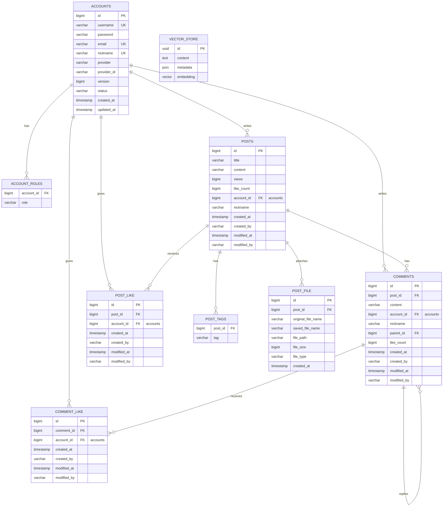

# PostForge MVP ERD

> Current status: 현재 구현을 시각화한 derived document다.
> Table ownership과 물리 schema의 기준은 [DB Schema Ownership](./schema-ownership.md)이다.

이 문서는 현재 relational/PgVector schema의 관계, 컬럼, index를 ERD 관점으로 보여준다. 학습(`study_*`) 표는 [DB Schema Ownership](./schema-ownership.md)에 있다.

## ERD

```mermaid
erDiagram
    ACCOUNTS ||--o{ ACCOUNT_ROLES : has
    ACCOUNTS ||--o{ POSTS : writes
    ACCOUNTS ||--o{ COMMENTS : writes
    ACCOUNTS ||--o{ POST_LIKE : gives
    ACCOUNTS ||--o{ COMMENT_LIKE : gives

    POSTS ||--o{ POST_TAGS : has
    POSTS ||--o{ COMMENTS : has
    COMMENTS ||--o{ COMMENTS : replies
    POSTS ||--o{ POST_LIKE : receives
    COMMENTS ||--o{ COMMENT_LIKE : receives
    POSTS ||--o{ POST_FILE : attaches

    ACCOUNTS {
        bigint id PK
        varchar username UK
        varchar password
        varchar email UK
        varchar nickname UK
        varchar provider
        varchar provider_id
        bigint version
        varchar status
        timestamp created_at
        timestamp updated_at
    }

    ACCOUNT_ROLES {
        bigint account_id FK
        varchar role
    }

    POSTS {
        bigint id PK
        varchar title
        varchar content
        bigint views
        bigint like_count
        bigint account_id FK "accounts"
        varchar nickname
        timestamp created_at
        varchar created_by
        timestamp modified_at
        varchar modified_by
    }

    POST_TAGS {
        bigint post_id FK
        varchar tag
    }

    COMMENTS {
        bigint id PK
        bigint post_id FK
        varchar content
        bigint account_id FK "accounts"
        varchar nickname
        bigint parent_id FK
        bigint like_count
        timestamp created_at
        varchar created_by
        timestamp modified_at
        varchar modified_by
    }

    POST_LIKE {
        bigint id PK
        bigint post_id FK
        bigint account_id FK "accounts"
        timestamp created_at
        varchar created_by
        timestamp modified_at
        varchar modified_by
    }

    COMMENT_LIKE {
        bigint id PK
        bigint comment_id FK
        bigint account_id FK "accounts"
        timestamp created_at
        varchar created_by
        timestamp modified_at
        varchar modified_by
    }

    POST_FILE {
        bigint id PK
        bigint post_id FK
        varchar original_file_name
        varchar saved_file_name
        varchar file_path
        bigint file_size
        varchar file_type
        timestamp created_at
    }

    VECTOR_STORE {
        uuid id PK
        text content
        json metadata
        vector embedding
    }
```

## Index Targets

| Query | Index Candidate |
| --- | --- |
| 게시글 최신순 | `posts(created_at)` |
| 작성자 게시글 | `posts(account_id)` |
| 댓글 조회 | `comments(post_id, created_at)` |
| 대댓글 조회 | `comments(parent_id)` |
| 중복 좋아요 방지 | `post_like(post_id, account_id)`, `comment_like(comment_id, account_id)` unique |
