# PostForge Current ERD

작성 기준: 현재 worktree의 JPA entity, JDBC 저장소, Spring AI PgVector 설정, `docs/db/migrations` SQL.

이 문서는 구현된 현재 스키마만 다룬다. `docs/db/schema-ownership.md`의 target schema candidates는 포함하지 않는다.
포트폴리오 설명용 축약본은 [postforge-portfolio-erd.md](./postforge-portfolio-erd.md)를 본다.

## ERD Role

이 ERD는 단순 게시판 DB가 아니라 "외부 쇼핑 데이터 수집 -> 내부 상품 카탈로그 정리 -> 가격 이력/최저가 추적 -> AI 자동 게시 -> 커뮤니티 게시판 노출" 흐름을 표현한다.

현재 물리 저장소는 PostgreSQL/pgvector 중심이다. Redis key, S3 object, 외부 API 자체는 이 ERD에 포함하지 않고 [schema-ownership.md](./schema-ownership.md)의 non-relational storage 섹션에서 별도로 다룬다.

## Module Table Roles

| Module | Tables | Role | Senior review note |
| --- | --- | --- | --- |
| `auth` | `accounts`, `account_roles` | 사용자 identity, OAuth/local login, 계정 상태, 권한 | 게시판 작성자/좋아요는 auth entity를 직접 참조하지 않고 `account_id` scalar로만 연결한다. |
| `board` | `posts`, `post_tags`, `comments`, `post_like`, `comment_like`, `post_file` | 커뮤니티 게시판 핵심 데이터 | `post_like`, `comment_like`, `post_file`은 실무 네이밍 관점에서 복수형(`post_likes`, `comment_likes`, `post_files`)으로 맞추는 편이 더 일관적이다. |
| `board` | `auto_post_drafts`, `post_product_links` | 가격 하락 자동 게시 초안/발행 상태와 게시글-상품 연결 | 즉시 발행만 한다면 `auto_post_drafts`는 과할 수 있다. 검수, 예약, 재시도, 중복 발행 방지가 필요할 때 유지 가치가 커진다. |
| `source` | `source_policies`, `external_api_request_logs` | 외부 API별 호출 정책과 실제 요청 로그 | 정책과 로그라 분리 이유는 있다. 다만 로그가 quota/circuit 판단까지 겸하므로 트래픽 증가 시 retention/집계 테이블을 검토해야 한다. |
| `ingest` | `tracked_keywords`, `collection_jobs`, `raw_products` | 수집 대상 설정, 수집 실행 상태, 외부 원본 payload 보관 | `raw_products`는 재처리/감사/디버깅 목적이 없으면 MVP에서는 보류하거나 TTL/archive 대상으로 둔다. |
| `catalog` | `product_categories`, `products`, `offers` | 외부 상품을 내부 상품/판매처 offer로 정규화 | `product_categories`와 `products.category1~3`는 역할이 겹친다. 둘 중 하나를 주 모델로 정리하는 것이 좋다. |
| `catalog` | `product_embeddings`, `product_match_candidates` | 상품 중복/유사도 매칭과 수동 검토 후보 | Spring AI `vector_store`와 목적이 다르다. 여기는 RAG 문서 검색이 아니라 상품 매칭용이다. 단, 여러 source 상품 병합/검수 기능이 없으면 확장 설계에 가깝다. |
| `price` | `price_snapshots`, `lowest_price_snapshots` | 시점별 가격 이력과 상품별 최신 최저가 read model | `price_snapshots`만으로도 가격 하락 계산은 가능하다. `lowest_price_snapshots`는 이력이 커졌을 때 빠른 조회/감지를 위한 최적화다. |
| `ai` | `vector_store` | RAG 문서 검색용 Spring AI PgVector 저장소 | 상품 유사도 매칭용 `product_embeddings`와 섞지 않는다. |
| `messaging` | `outbox_events` | 도메인 이벤트를 DB transaction 안에서 먼저 저장하고 relay하는 outbox | outbox 패턴에서는 실무적으로 자연스러운 이름과 역할이다. |

## Practical Simplification Notes

현재 스키마는 "간단한 쇼핑 게시판"보다 "상품 수집/정규화/가격추적/자동게시 플랫폼"에 가깝다. MVP로 줄이면 우선 `products`, `offers`, `price_snapshots`, `posts`, `post_product_links`를 중심으로 설명할 수 있다.

조건부 또는 후순위로 볼 수 있는 테이블은 다음이다.

| Table | Keep when | Simplify when |
| --- | --- | --- |
| `auto_post_drafts` | AI 결과 검수, 예약 발행, 실패 재처리, event id 기반 중복 방지가 필요하다. | AI 결과를 바로 `posts`에 발행한다. |
| `raw_products` | 외부 원본 재처리, 장애 분석, 감사 추적이 필요하다. | 정규화 결과만 보관해도 충분하다. |
| `product_embeddings` | 여러 source의 같은 상품을 벡터 기반으로 매칭해야 한다. | 단일 source이거나 external id 기준 upsert만 한다. |
| `product_match_candidates` | 사람이 상품 매칭 후보를 승인/거절하는 운영 화면이 있다. | 자동 매칭이나 수동 검수 흐름이 아직 없다. |
| `lowest_price_snapshots` | 상품별 현재 최저가/하락률을 자주 조회하고 가격 이력이 커진다. | 가격 이력이 작고 `price_snapshots`에서 계산해도 충분하다. |
| `external_api_request_logs` | 외부 API 장애 추적, quota/circuit 판단, 운영 감사가 필요하다. | 요청 단위 로그가 필요 없고 job 단위 결과만 보면 된다. |

## Naming Review

현재 이름은 구현 의도가 드러나는 장점은 있지만, 일부는 실무 DB 네이밍으로 다듬을 여지가 있다. 실제 rename은 entity, SQL migration, 코드 변경까지 함께 해야 하므로 이 문서는 후보만 기록한다.

| Current | Candidate | Reason |
| --- | --- | --- |
| `post_like` | `post_likes` | 테이블 복수형 일관성 |
| `comment_like` | `comment_likes` | 테이블 복수형 일관성 |
| `post_file` | `post_files` | 테이블 복수형 일관성 |
| `auto_post_drafts` | `generated_post_drafts` or `post_drafts` | AI/자동 여부보다 초안 lifecycle이 핵심 |
| `post_product_links` | `post_products` or `post_product_refs` | 게시글-상품 참조 테이블임을 더 짧게 표현 |
| `source_policies` | `api_source_policies` or `provider_policies` | `source` 단어가 추상적이다. |
| `external_api_request_logs` | `api_request_logs` or `source_request_logs` | 의미 중복을 줄인다. |
| `collection_jobs` | `product_collection_jobs` | 무엇을 수집하는 job인지 명확히 한다. |
| `raw_products` | `raw_product_payloads` or `product_ingest_records` | 원본 payload/ingest record 목적을 드러낸다. |
| `lowest_price_snapshots` | `current_lowest_prices` | 현재 read model이면 snapshot보다 current가 자연스럽다. |
| `product_match_candidates` | `product_match_reviews` | 사람이 검토하는 후보라면 review 의도가 더 명확하다. |

## Legend

- 실선 관계: JPA `@ManyToOne` 또는 migration SQL에 FK가 명시된 관계.
- 점선 관계: 컬럼 값으로만 연결하는 논리 관계. 현재 JPA/SQL에서 FK로 강제하지 않는다.
- `vector_store`는 Spring AI `PgVectorStore`가 초기화하는 RAG 문서 임베딩 테이블이다.

## Ownership Summary

| Owner | Tables |
| --- | --- |
| `auth` | `accounts`, `account_roles` |
| `board` | `posts`, `post_tags`, `comments`, `post_like`, `comment_like`, `post_file`, `auto_post_drafts`, `post_product_links` |
| `source` | `source_policies`, `external_api_request_logs` |
| `ingest` | `tracked_keywords`, `collection_jobs`, `raw_products` |
| `catalog` | `product_categories`, `products`, `offers`, `product_embeddings`, `product_match_candidates` |
| `price` | `price_snapshots`, `lowest_price_snapshots` |
| `ai` | `vector_store` |
| `messaging` | `outbox_events` |

## ERD

```mermaid
erDiagram
    accounts ||--o{ account_roles : has
    accounts ||..o{ posts : "account_id"
    accounts ||..o{ comments : "account_id"
    accounts ||..o{ post_like : "account_id"
    accounts ||..o{ comment_like : "account_id"

    posts ||--o{ post_tags : has
    posts ||--o{ comments : has
    comments ||--o{ comments : replies
    posts ||--o{ post_like : liked_by
    comments ||--o{ comment_like : liked_by
    posts ||--o{ post_file : attaches
    posts ||--o| post_product_links : links_product
    posts ||..o{ auto_post_drafts : published_as

    tracked_keywords ||..o{ collection_jobs : starts
    collection_jobs ||--o{ raw_products : collects

    product_categories ||..o{ product_categories : parent
    product_categories ||--o{ products : categorizes
    products ||--o{ offers : has
    products ||--|| product_embeddings : embeds
    products ||..o{ product_match_candidates : source_product
    products ||..o{ product_match_candidates : candidate_product

    products ||..o{ price_snapshots : priced
    offers ||..o{ price_snapshots : sampled_offer
    products ||..|| lowest_price_snapshots : current_lowest
    offers ||..o{ lowest_price_snapshots : current_offer
    products ||..o{ post_product_links : linked_posts
    products ||..o{ auto_post_drafts : drafted_for

    accounts {
        bigint id PK
        varchar username UK
        varchar password
        varchar email UK
        varchar nickname UK
        varchar provider
        varchar provider_id
        bigint version
        varchar status
        timestamp created_at
        timestamp updated_at
    }

    account_roles {
        bigint account_id FK
        varchar role
    }

    posts {
        bigint id PK
        varchar title
        varchar content
        varchar summary
        varchar category
        bigint views
        bigint like_count
        bigint account_id
        varchar nickname
        timestamp created_at
        varchar created_by
        timestamp modified_at
        varchar modified_by
    }

    post_tags {
        bigint post_id FK
        varchar tag
    }

    comments {
        bigint id PK
        bigint post_id FK
        varchar content
        bigint account_id
        varchar nickname
        bigint parent_id FK
        bigint like_count
        timestamp created_at
        varchar created_by
        timestamp modified_at
        varchar modified_by
    }

    post_like {
        bigint id PK
        bigint post_id FK
        bigint account_id
        timestamp created_at
        varchar created_by
        timestamp modified_at
        varchar modified_by
    }

    comment_like {
        bigint id PK
        bigint comment_id FK
        bigint account_id
        timestamp created_at
        varchar created_by
        timestamp modified_at
        varchar modified_by
    }

    post_file {
        bigint id PK
        varchar original_file_name
        varchar saved_file_name
        varchar file_path
        bigint file_size
        varchar file_type
        timestamp created_at
        bigint post_id FK
    }

    auto_post_drafts {
        bigint id PK
        bigint product_id
        varchar event_id UK
        varchar title
        varchar content
        varchar status
        bigint post_id
        timestamp created_at
        timestamp published_at
    }

    post_product_links {
        bigint id PK
        bigint post_id FK
        bigint product_id
        date post_date
        timestamp created_at
    }

    source_policies {
        bigint id PK
        varchar source UK
        boolean enabled
        int daily_quota
        int max_retry_attempts
        int circuit_failure_threshold
        timestamp created_at
        timestamp updated_at
    }

    external_api_request_logs {
        bigint id PK
        varchar source
        varchar endpoint
        varchar request_key
        int status_code
        boolean success
        bigint response_time_ms
        varchar error_message
        timestamp requested_at
    }

    tracked_keywords {
        bigint id PK
        varchar keyword
        varchar source
        int interval_minutes
        int display_count
        boolean enabled
        timestamp created_at
        timestamp updated_at
    }

    collection_jobs {
        bigint id PK
        bigint tracked_keyword_id
        varchar source
        varchar keyword
        varchar status
        timestamp requested_at
        timestamp started_at
        timestamp finished_at
        int collected_count
        varchar failure_reason
        int retry_count
    }

    raw_products {
        bigint id PK
        bigint collection_job_id FK
        varchar source
        varchar external_product_id
        text raw_payload
        timestamp collected_at
    }

    product_categories {
        bigint id PK
        varchar name UK
        bigint parent_id
        int depth
        timestamp created_at
        timestamp updated_at
    }

    products {
        bigint id PK
        varchar source
        varchar external_product_id
        varchar name
        varchar normalized_name
        varchar brand
        varchar maker
        bigint category_id FK
        varchar category1
        varchar category2
        varchar category3
        bigint current_price
        varchar image_url
        varchar product_url
        varchar mall_name
        varchar status
        timestamp created_at
        timestamp updated_at
    }

    offers {
        bigint id PK
        bigint product_id FK
        varchar source
        varchar external_product_id
        varchar mall_name
        varchar title
        varchar product_url
        varchar image_url
        boolean active
        timestamp created_at
        timestamp updated_at
    }

    product_embeddings {
        bigint product_id PK
        text embedding_input
        vector embedding
        timestamp created_at
        timestamp updated_at
    }

    product_match_candidates {
        bigint id PK
        bigint source_product_id
        varchar source
        varchar external_product_id
        varchar source_product_title
        bigint candidate_product_id
        decimal similarity_score
        boolean brand_matched
        boolean category_matched
        varchar status
        timestamp created_at
        timestamp updated_at
    }

    price_snapshots {
        bigint id PK
        bigint product_id
        bigint offer_id
        varchar source
        varchar external_product_id
        bigint price
        timestamp collected_at
    }

    lowest_price_snapshots {
        bigint id PK
        bigint product_id UK
        bigint offer_id
        varchar source
        varchar external_product_id
        bigint lowest_price
        bigint previous_lowest_price
        decimal drop_rate
        timestamp changed_at
        timestamp collected_at
    }

    vector_store {
        uuid id PK
        text content
        json metadata
        vector embedding
    }

    outbox_events {
        bigint id PK
        varchar event_id UK
        varchar event_type
        varchar aggregate_type
        varchar aggregate_id
        text payload
        varchar status
        int retry_count
        timestamptz available_at
        timestamptz occurred_at
        timestamptz published_at
        varchar last_error
        timestamptz created_at
        timestamptz updated_at
    }
```

## Relationship Notes

| From | To | Type | Note |
| --- | --- | --- | --- |
| `account_roles.account_id` | `accounts.id` | physical | `Account.roles` collection table |
| `posts.account_id` | `accounts.id` | logical | board stores account id snapshot, no JPA `Account` relation |
| `comments.account_id` | `accounts.id` | logical | author id snapshot |
| `post_like.account_id` | `accounts.id` | logical | uniqueness is `(post_id, account_id)` |
| `comment_like.account_id` | `accounts.id` | logical | uniqueness is `(comment_id, account_id)` |
| `comments.post_id` | `posts.id` | physical | `Comment.post` |
| `comments.parent_id` | `comments.id` | physical | 1-depth reply tree in service policy |
| `post_file.post_id` | `posts.id` | physical nullable | files can exist before being attached |
| `post_product_links.post_id` | `posts.id` | physical | one product-link row per post |
| `post_product_links.product_id` | `products.id` | logical | board does not map catalog entity |
| `auto_post_drafts.post_id` | `posts.id` | physical in migration, scalar in entity |
| `auto_post_drafts.product_id` | `products.id` | logical | draft target product |
| `raw_products.collection_job_id` | `collection_jobs.id` | physical | raw payload belongs to a collection job |
| `collection_jobs.tracked_keyword_id` | `tracked_keywords.id` | logical nullable | job can be manual |
| `products.category_id` | `product_categories.id` | physical nullable | normalized product category |
| `product_categories.parent_id` | `product_categories.id` | logical nullable | category tree |
| `offers.product_id` | `products.id` | physical | source/mall offer for a product |
| `product_embeddings.product_id` | `products.id` | physical in migration/JDBC contract | one embedding row per product |
| `product_match_candidates.source_product_id` | `products.id` | logical | candidate source product |
| `product_match_candidates.candidate_product_id` | `products.id` | logical | possible matching product |
| `price_snapshots.product_id` | `products.id` | logical | price module stores scalar ids |
| `price_snapshots.offer_id` | `offers.id` | logical | price module stores scalar ids |
| `lowest_price_snapshots.product_id` | `products.id` | logical unique | one current lowest read model per product |
| `lowest_price_snapshots.offer_id` | `offers.id` | logical | offer that supplied the current lowest price |

## Source Files

| Area | Source |
| --- | --- |
| auth | `auth/src/main/java/dev/iamrat/auth/account/domain/Account.java` |
| board | `board/src/main/java/dev/iamrat/board/**/domain/*.java` |
| source | `source/src/main/java/dev/iamrat/source/product/domain/*.java` |
| ingest | `ingest/src/main/java/dev/iamrat/ingest/product/domain/*.java` |
| catalog | `catalog/src/main/java/dev/iamrat/catalog/product/domain/*.java`, `catalog/src/main/java/dev/iamrat/catalog/matching/domain/*.java`, `catalog/src/main/java/dev/iamrat/catalog/matching/infrastructure/persistence/ProductEmbeddingJdbcStore.java` |
| price | `price/src/main/java/dev/iamrat/price/tracking/domain/*.java` |
| ai | `ai/src/main/java/dev/iamrat/ai/search/infrastructure/vector/PgVectorConfig.java`, Spring AI `PgVectorStore` default schema |
| messaging | `messaging/src/main/java/dev/iamrat/messaging/outbox/domain/OutboxMessage.java` |

DBML version: [postforge-current-erd.dbml](./postforge-current-erd.dbml)
