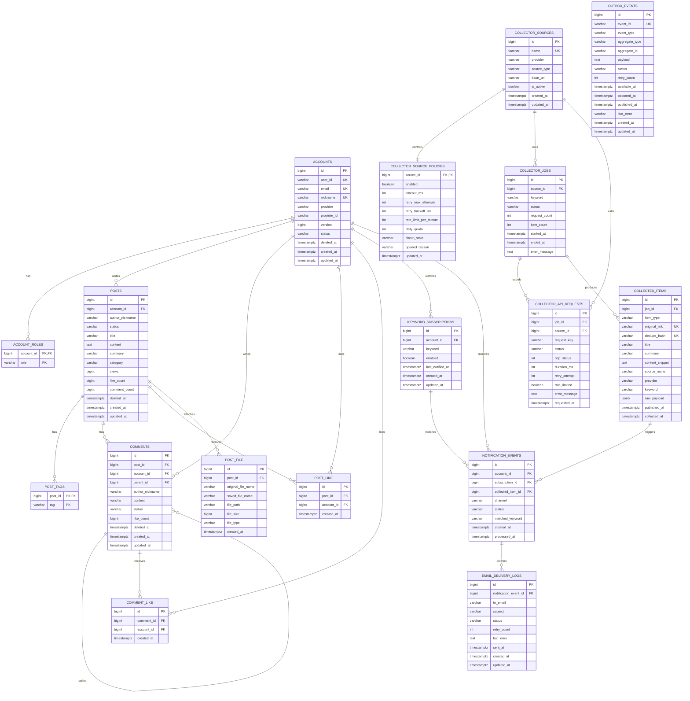

# PostForge MVP ERD

이 문서는 PostForge를 취업 포트폴리오 MVP 범위로 줄인 ERD 설계안이다.
이번 MVP의 중심은 게시판 랭킹이 아니라, 외부 API에서 정보를 수집하고 사용자가 구독한 키워드에 맞는 새 정보만 이메일로 전달하는 파이프라인이다.

## MVP 제품 문장

PostForge는 외부 API에서 기술/시장/뉴스 정보를 수집하고, 사용자가 설정한 키워드에 맞는 새 정보만 이메일로 받아보는 Spring Boot 백엔드다.

이 MVP에서 보여줄 핵심 역량은 다음이다.

- 외부 API 호출을 timeout, retry, rate limit, request log로 통제한다.
- 수집 데이터를 중복 제거하고 원본 item으로 저장한다.
- 사용자가 관심 키워드를 구독할 수 있다.
- 수집 item과 키워드 구독을 매칭해 알림 이벤트를 만든다.
- 이메일 발송 성공/실패/재시도 상태를 기록한다.
- 게시판은 기존 커뮤니티 기능으로 유지하되, MVP 차별 기능은 키워드 알림으로 둔다.

## Scope

### Included

| Area | Tables | Purpose |
| --- | --- | --- |
| auth | `accounts`, `account_roles` | 사용자 identity와 권한 |
| board baseline | `posts`, `post_tags`, `comments`, `post_like`, `comment_like`, `post_file` | 기존 커뮤니티 게시판 기능 |
| collector | `collector_sources`, `collector_source_policies`, `collector_jobs`, `collector_api_requests`, `collected_items` | 외부 API 수집과 호출 제어 |
| messaging | `outbox_events` | 기능 모듈과 직접 결합하지 않는 독립 outbox 인프라 |
| keyword watch | `keyword_subscriptions` | 사용자별 관심 키워드 구독 |
| notification | `notification_events`, `email_delivery_logs` | 수집 item 매칭 결과와 이메일 발송 이력 |

### Deferred

| Deferred Area | Reason |
| --- | --- |
| trend cluster | 키워드 알림 MVP 이후 상품 추천/트렌드 분석 분기로 확장할 때 추가한다. |
| post evidence/reference links | 게시판 글쓰기 확장 기능이며 알림 MVP의 필수 흐름이 아니다. |
| ranking/read model | 단순 게시판 정렬에는 과하고, 추천/쇼핑몰 분기에서 다시 검토한다. |
| external MQ broker | DB outbox relay 이후 Kafka/RabbitMQ/SQS가 필요할 때 추가한다. |
| private workspace | 취업용 MVP의 핵심 설명에서 벗어나고 구현량이 급증한다. |
| billing/subscription | 실제 결제 정책 없이 테이블만 만들면 포트폴리오 메시지가 흐려진다. |
| full AI writing assistant | 비용 정책, quota, prompt 품질, UX까지 같이 풀어야 해서 1차 MVP에서 제외한다. |

## Boundary Rules

- `board`, `collector`, `notification`은 서로의 table을 직접 쓰지 않는다.
- `messaging.outbox_events`는 어떤 도메인 table과도 FK를 맺지 않는다.
- `outbox_events.aggregate_type`, `aggregate_id`는 logical reference다. DB referential integrity가 아니라 message contract로 해석한다.
- 현재 ERD에서 `messaging`은 standalone infrastructure다. 기능 모듈 연결은 별도 phase에서 event contract를 정한 뒤 붙인다.
- `notification_events`는 outbox가 아니라 "누구에게 무엇을 알려야 하는가"를 기록하는 업무 queue다.

## ERD



## Table Roles

### accounts / account_roles

현재 구현의 사용자 기반을 유지한다.
MVP의 목적은 인증 시스템을 새로 설계하는 것이 아니라, 키워드 구독과 알림 수신자를 명확히 하는 것이다.

`accounts.version`은 계정 row의 낙관적 락 충돌 감지를 위한 JPA version 필드다.
`accounts.status`, `deleted_at`은 탈퇴/정지/soft delete를 설명하기 위한 운영 필드다.
`provider`, `provider_id`는 OAuth identity 확장을 고려한 필드다.

### posts / comments / likes / files / tags

기존 게시판 기능이다.
MVP의 핵심 차별 기능은 아니지만, 사용자가 알림으로 받은 정보를 바탕으로 글을 작성하거나 토론하는 확장 지점으로 유지한다.

게시판 정렬은 MVP에서 복합 ranking table을 두지 않고 다음과 같은 단순 정렬과 count 기반으로 처리한다.

- 최신순: `posts.created_at`
- 조회순: `posts.views`
- 좋아요순: `posts.like_count`
- 댓글순: `posts.comment_count`

### collector_sources

외부 API/provider의 기준 테이블이다.
예를 들어 Naver News, 공식 문서 RSS, 블로그 검색 API 같은 source를 여기에 등록한다.

이 테이블을 둔 이유는 수집 로직이 특정 API 이름에 하드코딩되지 않게 하기 위해서다.

### collector_source_policies

외부 API 호출 제어 정책이다.
timeout, retry, backoff, rate limit, daily quota, circuit state를 source별로 분리한다.

MVP 구현은 env/config 기반으로 시작할 수 있다.
이 테이블은 다중 source, 운영자 제어, 여러 worker 간 상태 공유가 필요해질 때 DB 정책으로 승격하는 구조다.

### collector_jobs

수집 실행 단위다.
스케줄러가 실행했는지, 관리자가 수동 실행했는지, 어떤 keyword로 실행했는지를 하나의 job으로 묶는다.

`request_count`, `item_count`, `status`, `error_message`를 통해 수집 결과를 운영 관점에서 추적한다.

### collector_api_requests

실제 외부 API 호출 attempt 로그다.
하나의 job 안에서도 여러 request가 발생할 수 있으므로 job과 분리한다.

성능/운영 테스트에서 확인할 수 있는 항목은 다음이다.

- timeout 발생률
- retry 횟수
- rate limit 발생 여부
- source별 latency
- 실패 source와 성공 source 분리

### collected_items

외부 API로 들어온 원본 item의 정규화 테이블이다.
기존 `collected_articles`보다 범위를 넓혀 news, blog, official doc, market signal 등을 담을 수 있게 한다.

`original_link`와 `dedupe_hash`를 둔 이유는 중복 수집 방지 때문이다.
`raw_payload`는 provider별 원본 응답을 보관하기 위한 jsonb 필드다.
나중에 파싱 정책이 바뀌어도 원본을 다시 볼 수 있다.

### keyword_subscriptions

사용자가 받고 싶은 관심 키워드다.
예를 들어 `Spring AI`, `RTX 5090`, `PostgreSQL`, `채용 공고` 같은 키워드를 등록한다.

추천 필드:

- `account_id`: 구독자
- `keyword`: 매칭할 키워드
- `enabled`: 알림 활성 여부
- `last_notified_at`: 마지막 알림 시각

`(account_id, keyword)` unique로 같은 사용자의 중복 구독을 막는다.

### outbox_events

기능 모듈과 직접 결합하지 않는 공통 outbox 인프라 테이블이다.
ERD에서는 어떤 도메인 테이블과도 FK를 맺지 않는다.

`aggregate_type`, `aggregate_id`는 문자열 기반 logical reference다.
예를 들어 나중에 `collector.item.created.v1` 같은 이벤트를 연결하더라도, `collected_items.id`에 DB FK를 걸지 않는다.

추천 상태:

- `PENDING`: 발행 대기
- `PROCESSING`: relay가 claim 후 처리 중
- `PUBLISHED`: 전달 성공
- `FAILED`: 전달 실패 후 backoff 대기

이 테이블은 "어떤 일이 발생했는가"를 안정적으로 남기는 기술 이벤트 저장소다.
기능 모듈이 outbox를 사용할지는 후속 phase에서 event contract와 module dependency를 정한 뒤 결정한다.
`notification_events`는 outbox를 소비한 결과일 수도 있지만, MVP에서는 수집 item과 키워드 구독 매칭으로 직접 생성해도 된다.

### notification_events

수집 item과 키워드 구독이 매칭된 결과다.
outbox가 아니라, 제품 의미가 명확한 알림 queue다.

추천 상태:

- `PENDING`: 이메일 발송 대기
- `PROCESSING`: worker가 처리 중
- `SENT`: 이메일 발송 성공
- `FAILED`: 발송 실패 후 재시도 대상
- `SKIPPED`: 중복, 비활성 구독, 탈퇴 계정 등으로 발송하지 않음

`(subscription_id, collected_item_id, channel)` unique로 같은 item을 같은 구독자에게 반복 발송하지 않는다.

### email_delivery_logs

이메일 발송 attempt 또는 최종 이력을 저장한다.
`notification_events`는 "무엇을 누구에게 알려야 하는가"이고, `email_delivery_logs`는 "메일 발송이 실제로 어떻게 되었는가"를 기록한다.

추천 필드:

- `to_email`
- `subject`
- `status`
- `retry_count`
- `last_error`
- `sent_at`

## Main Flows

### 1. External API Collection

```text
collector_sources
-> collector_source_policies
-> collector_jobs
-> collector_api_requests
-> collected_items
```

외부 API 호출은 source policy 또는 env/config 정책을 통과한다.
각 호출 attempt는 `collector_api_requests`에 남기고, 성공한 응답은 `collected_items`로 정규화한다.

### 2. Keyword Watch Setup

```text
accounts
-> keyword_subscriptions
```

사용자는 관심 키워드를 등록하고, 비활성화하거나 삭제할 수 있다.
MVP에서는 단순 문자열 contains/normalized keyword 매칭으로 시작한다.

### 3. Messaging Infrastructure

```text
outbox_events
-> relay
-> dispatcher or MQ adapter
```

`messaging`은 독립 인프라로 둔다.
현재 ERD에서는 `board`, `collector`, `notification`이 `outbox_events`에 직접 연결되어 있지 않다.
나중에 연결할 때도 FK가 아니라 event type과 payload contract로 연결한다.

### 4. Notification Matching

```text
collected_items
+ keyword_subscriptions
-> notification_events
```

새 수집 item이 저장되면 활성 키워드 구독과 매칭한다.
매칭되면 `notification_events`를 만들고, 같은 item과 subscription 조합은 unique constraint로 중복 생성하지 않는다.

### 5. Email Delivery

```text
notification_events(PENDING)
-> email_delivery_logs
-> notification_events(SENT or FAILED)
```

메일 worker는 pending 알림을 읽어 이메일을 발송한다.
성공하면 `SENT`, 실패하면 `FAILED`와 `last_error`, `retry_count`를 남긴다.

## Index Targets

| Query | Index Candidate |
| --- | --- |
| 공개 게시글 최신순 | `posts(status, created_at)` |
| 작성자 게시글 | `posts(account_id, created_at)` |
| 카테고리 게시글 | `posts(category, created_at)` |
| 댓글 조회 | `comments(post_id, created_at)` |
| 중복 좋아요 방지 | `post_like(post_id, account_id) unique` |
| 수집 중복 방지 | `collected_items(original_link) unique`, `collected_items(dedupe_hash) unique` |
| source별 API 호출 추적 | `collector_api_requests(source_id, requested_at)` |
| keyword 수집 item 조회 | `collected_items(keyword, collected_at)` |
| 사용자 키워드 구독 | `keyword_subscriptions(account_id, keyword) unique` |
| 활성 키워드 매칭 | `keyword_subscriptions(enabled, keyword)` |
| outbox relay polling | `outbox_events(status, available_at)` |
| aggregate별 이벤트 추적 | `outbox_events(aggregate_type, aggregate_id)` |
| 중복 알림 방지 | `notification_events(subscription_id, collected_item_id, channel) unique` |
| 알림 worker polling | `notification_events(status, created_at)` |
| 이메일 발송 이력 조회 | `email_delivery_logs(notification_event_id, created_at)` |

## Performance And Reliability Story

이 ERD는 성능보다 운영 안정성을 먼저 설명한다.

| Topic | Before | After |
| --- | --- | --- |
| 외부 API 수집 | 실패/timeout/retry가 로그 없이 섞임 | request attempt 단위로 상태와 latency 추적 |
| 중복 수집 | 같은 원문을 반복 저장 | `original_link`, `dedupe_hash` unique |
| 키워드 알림 | 수집 결과를 사용자가 직접 찾아야 함 | subscription 매칭 후 이메일 알림 생성 |
| 후처리 이벤트 | 커밋 이후 프로세스 장애 시 이벤트 유실 가능 | 후속 phase에서 outbox contract로 연결 가능 |
| 메일 발송 실패 | 실패 이유와 재시도 상태가 사라짐 | `email_delivery_logs`에 실패/재시도 기록 |
| 게시글 목록 | 복합 랭킹 없이 단순 정렬 | count column + index 기반 정렬 |

## Implementation Order

1. 현재 게시판 스키마는 유지하고 목록/상세 baseline을 정리한다.
2. collector 영역에 `collector_sources`, `collector_source_policies`, `collector_jobs`, `collector_api_requests`, `collected_items`를 추가한다.
3. `messaging` 모듈의 `outbox_events`를 standalone 인프라로 추가한다.
4. `keyword_subscriptions`를 추가해 사용자가 관심 키워드를 등록하게 한다.
5. 수집 item 저장 후 키워드 매칭으로 `notification_events`를 생성한다.
6. `email_delivery_logs`를 추가하고 pending notification을 이메일로 발송한다.
7. 실패/재시도/중복 방지 시나리오를 테스트한다.
8. 기능 모듈과 `messaging` 연결은 event contract를 정한 뒤 별도 phase에서 진행한다.
9. README와 성능/운영 문서에 외부 API 수집 안정성과 알림 파이프라인을 정리한다.

## Future Extension Boundary

다음 기능은 MVP ERD에 넣지 않는다.
문서상 future extension으로만 남긴다.

- trend cluster: `trend_clusters`, `trend_cluster_items`
- 게시글 reference/evidence 연결: `post_reference_links`
- 상품 추천/쇼핑몰 분기: `products`, `product_trend_links`, `product_rank_scores`
- external MQ broker: Kafka/RabbitMQ/SQS publisher
- private report workspace: `workspaces`, `drafts`, `draft_sources`
- saved trend bundle: `saved_trend_bundles`, `saved_trend_bundle_items`
- billing: `subscription_plans`, `account_subscriptions`
- AI cost control: `ai_budget_windows`, `ai_usage_logs`
- AI writing assistant: operation log, prompt history, generated suggestion table

이 기능들은 나중에 추가할 수 있지만, 현재 포트폴리오의 1차 목표는 "외부 API 수집 데이터를 사용자 관심 키워드와 매칭해 이메일로 전달하는 백엔드"로 고정한다.
