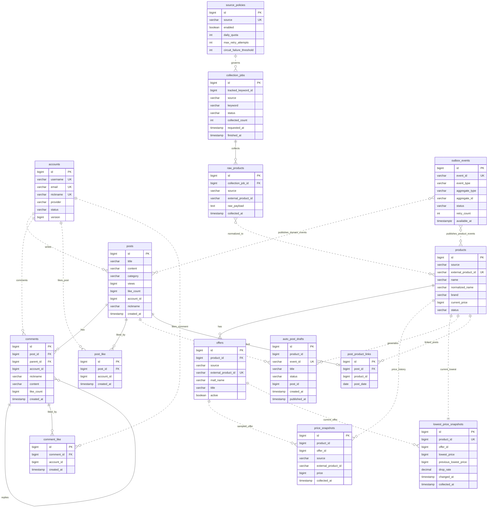

# PostForge Portfolio ERD

포트폴리오 설명용 축약 ERD다. 전체 테이블 맵은 [postforge-current-erd.md](./postforge-current-erd.md)를 본다.

이 문서는 "커뮤니티 게시판 + 상품 수집 + 가격 추적 + 자동 게시" 흐름을 설명하는 데 필요한 핵심 테이블만 남긴다.

## Included Tables

| Area | Tables | Why included |
| --- | --- | --- |
| Auth | `accounts` | 사용자 identity와 작성자 기준 |
| Board | `posts`, `comments`, `post_like`, `comment_like` | 커뮤니티 핵심 기능 |
| Product collection | `source_policies`, `collection_jobs`, `raw_products` | 외부 API 호출 정책, 수집 실행 이력, 필요 시 원본 payload 보관 |
| Catalog | `products`, `offers` | 정규화 상품과 판매처별 offer |
| Price | `price_snapshots`, `lowest_price_snapshots` | 가격 이력과 최신 최저가 read model |
| Auto post | `auto_post_drafts`, `post_product_links` | 가격 하락 자동 게시와 상품-게시글 연결 |
| Reliability | `outbox_events` | 이벤트 전달 신뢰성 경계 |

## Practical Reading

포트폴리오에서 이 ERD를 설명할 때는 모든 테이블을 같은 무게로 말하지 않는다. 핵심은 `products`, `offers`, `price_snapshots`, `posts`, `post_product_links`이고, 나머지는 운영 안정성 또는 확장 기능이다.

| Weight | Tables | How to explain |
| --- | --- | --- |
| Core flow | `products`, `offers`, `price_snapshots`, `posts`, `post_product_links` | 외부 상품을 내부 상품으로 정리하고 가격 이력을 기반으로 게시판 콘텐츠와 연결한다. |
| Operational support | `source_policies`, `collection_jobs`, `outbox_events` | 외부 API 제어, 수집 작업 추적, 이벤트 전달 안정성을 위한 테이블이다. |
| Conditional support | `raw_products`, `external_api_request_logs`, `lowest_price_snapshots`, `auto_post_drafts` | 재처리/감사, 요청 단위 운영 로그, 빠른 최저가 조회, AI 초안 검수/재시도가 필요할 때 가치가 커진다. |
| Extension | `product_embeddings`, `product_match_candidates`, `vector_store` | 상품 매칭 또는 RAG 검색 확장 영역이다. 핵심 ERD에서는 복잡도를 줄이기 위해 생략한다. |

## Naming Notes

현재 ERD는 구현된 테이블명을 그대로 사용한다. 다만 실무 네이밍으로 다듬는다면 다음 후보를 검토한다.

| Current | Candidate |
| --- | --- |
| `post_like` | `post_likes` |
| `comment_like` | `comment_likes` |
| `post_file` | `post_files` |
| `collection_jobs` | `product_collection_jobs` |
| `raw_products` | `raw_product_payloads` |
| `lowest_price_snapshots` | `current_lowest_prices` |
| `auto_post_drafts` | `generated_post_drafts` or `post_drafts` |

## Omitted From This View

| Omitted | Reason |
| --- | --- |
| `account_roles` | 권한 보조 테이블. auth 설명에서는 중요하지만 핵심 도메인 흐름에서는 보조적이다. |
| `post_tags` | 게시글 검색/분류 보조 테이블. |
| `post_file` | 파일 업로드 기능 설명 시 별도 언급하면 된다. |
| `tracked_keywords` | 수집 스케줄 설정 테이블. `collection_jobs` 중심 설명만으로 흐름 전달 가능. |
| `external_api_request_logs` | 운영/장애 추적 보조 테이블. |
| `product_categories` | 상품 분류 보조 테이블. |
| `product_embeddings`, `product_match_candidates`, `vector_store` | AI/search/matching 확장 테이블. ERD가 복잡해져 별도 AI/RAG 설명으로 분리한다. |

## ERD

## How To Explain

1. `accounts`가 게시글/댓글/좋아요의 작성자 기준이 된다. board는 auth entity를 직접 참조하지 않고 `account_id` snapshot을 저장한다.
2. `source_policies`가 외부 API 호출 정책을 정하고, `collection_jobs`와 `raw_products`가 수집 실행과 원본 응답을 남긴다.
3. 수집된 raw data는 `products`와 `offers`로 정규화된다. `products`는 내부 기준 상품, `offers`는 판매처/source별 판매 항목이다.
4. `price_snapshots`는 offer 가격 이력이고, `lowest_price_snapshots`는 product별 최신 최저가 read model이다.
5. 가격 하락 흐름은 `post_product_links`를 통해 게시판과 연결된다. `auto_post_drafts`는 즉시 발행이 아니라 초안 검수/재시도/중복 방지를 설명할 때 강조한다.
6. `outbox_events`는 도메인 이벤트를 안정적으로 외부로 넘기기 위한 신뢰성 경계다.

DBML version: [postforge-portfolio-erd.dbml](./postforge-portfolio-erd.dbml)
